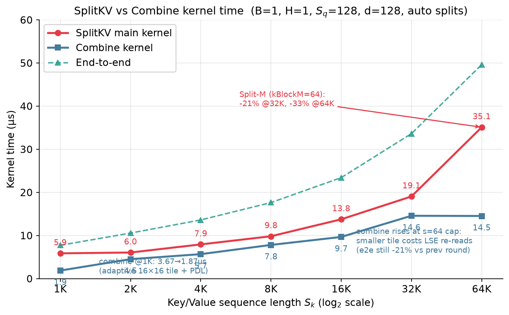
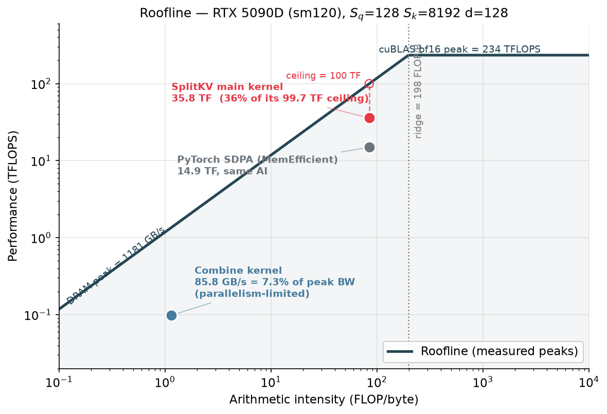
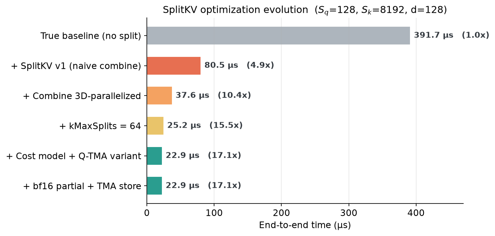

# FlashAttention-2 在 Blackwell (sm120) 上的移植与优化全记录

> **硬件**：RTX 5090D（GB202，sm_120，170 SMs，~100KB smem/CTA，cuBLAS bf16 实测峰值 **235 TFLOPS**）
> **软件**：CUDA 12.9 / PyTorch / CUTLASS+CuTe（thirdparty）
> **算子**：带任意加法 mask 的 FA2 Forward（bf16，d∈{64,128}，支持 GQA）
> **最终结果**：标准场景 **160~197 TFLOPS**（cuBLAS 峰值的 70~85%，SDPA 的 **2~2.7x**）；小 grid 长序列场景相对无 split 基线 **8.3~37.5x**，相对 SDPA **15~53x**

---

## 目录

1. [背景与目标](#1-背景与目标)
2. [第一步：摸清 sm90 与 sm120 的硬件差异](#2-第一步摸清-sm90-与-sm120-的硬件差异)
3. [优化历程时间线](#3-优化历程时间线)
   - [Phase 1：TMA + mbarrier 多级流水线移植](#phase-1tma--mbarrier-多级流水线移植)
   - [Phase 2：流水线深化——双 barrier 拆分（d64 +56~61%）](#phase-2流水线深化双-barrier-拆分d64-5661)
   - [Phase 3：QInRegs——寄存器换流水深度（d128 补齐差距）](#phase-3qinregs寄存器换流水深度d128-补齐差距)
   - [Phase 4：Warp Specialization 实验（负收益，果断回退）](#phase-4warp-specialization-实验负收益果断回退)
   - [Phase 5：NCU 驱动的精细化调优](#phase-5ncu-驱动的精细化调优)
   - [Phase 6：Persistent Kernel（有场景价值的过渡技术）](#phase-6persistent-kernel有场景价值的过渡技术)
   - [Phase 7：Split KV——小 grid 场景的 10~37 倍杀器](#phase-7split-kv小-grid-场景的-1037-倍杀器)
     - [7.9 Split KV kernel 随 Sk 的耗时分解](#79-split-kv-kernel-随-sk-的耗时分解)
     - [7.10 Roofline 分析](#710-roofline-分析)
     - [7.11 NCU 详细指标总结](#711-ncu-详细指标总结)
4. [最终性能全景](#4-最终性能全景)
5. [经验总结：可复用的方法论](#5-经验总结可复用的方法论)

---

## 1. 背景与目标

业务需要一个支持**任意加法 mask**（item 级屏蔽，0=可见 / -inf=屏蔽）的 Attention Forward 算子，目标硬件是消费级 Blackwell（RTX 5090D, sm120）。

一个关键前提：**PyTorch SDPA 在带任意 `attn_mask` 时只能走 MemEfficient 后端**（FlashAttention 后端不支持任意 mask），实测标准场景只有 55~99 TFLOPS；而 FA2/FA3 的官方实现分别以 sm80（cp.async）和 sm90（wgmma+TMA）为目标，均无法直接在 sm120 上发挥新特性。

**目标**：参考 FA3 (hopper) 的写法，把 FA2 移植到 sm120，用足 TMA 等新特性，显著超越 SDPA。

---

## 2. 第一步：摸清 sm90 与 sm120 的硬件差异

动手前先系统调研了 `thirdparty/cutlass` 与 `thirdparty/cute` 中的架构基础设施，结论是整个项目的技术选型基础：

| 特性 | sm90 (H100) | sm120 (5090D) | 移植决策 |
|---|---|---|---|
| **wgmma** (warpgroup MMA) | ✅ (sm90a) | ❌ **不存在** | 回退 SM80 `mma.sync` (16x8x16) |
| **tcgen05.mma** | ❌ | ❌（仅 sm100/B200） | 同上 |
| **TMA** (`cp.async.bulk.tensor`) | ✅ | ✅ 但**仅 `shared::cta`** | ✅ 照搬，无 cluster/multicast |
| **mbarrier** | ✅ | ✅ | ✅ 照搬，手搓轻量流水线 |
| **Cluster / TMA multicast** | ✅ | ❌（CUTLASS 断言禁用） | 不用 |
| **stmatrix (STSM)** | ✅ | ✅ | ✅ epilogue 采用 |
| **smem/CTA** | 227KB | **~100KB** | 流水深度受限，需精打细算 |
| **MMA 峰值 (bf16)** | 989 TF | ~235 TF（实测 cuBLAS） | 参照系 |

> **核心结论（后被反复验证）**：sm120 移植 Hopper kernel 时，**TMA + mbarrier 流水线值得照搬；wgmma 体系和 warp specialization 不应照搬**——前者硬件支持，后者在硬件上根本不存在。

---

## 3. 优化历程时间线

### Phase 1：TMA + mbarrier 多级流水线移植

**方案**：以 FA2 的 `mma.sync` 计算骨架为基础，数据通路全面替换为 Hopper 风格：

- Q/K/V/Mask 的 gmem→smem 搬运全部由 **TMA**（单线程发射、`__grid_constant__` 传 descriptor）替代 cp.async 多线程协作拷贝
- K/V/Mask 三级（kStages=2~3）smem 流水，`ClusterTransactionBarrier` 做 arrive-and-expect-tx 事务屏障
- Epilogue：acc → STSM 写 swizzled smem → TMA store（自动处理边界裁剪，消灭 `Is_even_MN/Is_even_K` 分支）
- L2 cache hint：K/V/Mask `EVICT_LAST`（跨 CTA 复用），Q `EVICT_FIRST`（一次性）

**结果**：首个可用版本与原 cp.async baseline **性能持平**（d64 ≈112 TF / d128 ≈187 TF @ B4H16 2048²）——证明"搬运路径不是瓶颈时，TMA 本身不产生收益"，收益要靠后续的流水线结构挖掘。

### Phase 2：流水线深化——双 barrier 拆分（d64 +56~61%）

**关键洞察**：单 barrier 等待 K+V+Mask 全部就绪才能启动 QK^T，把 V/Mask 的传输延迟串进了关键路径。

**方案**：拆成两组 full barrier——**K 单独一组**（就绪即可启动 QK gemm），**V+Mask 一组**（QK 算完才消费），让 QK 计算与 V/Mask 传输重叠。

**结果**（vs cp.async baseline）：

```
B4 H16 2048² d64:   114 TF ──────────► 180 TF   (+58%)
B16 H16 1024² d64:  117 TF ──────────► 189 TF   (+61%)   ← 达 cuBLAS 峰值 80%
```

d128 此时仍落后 baseline 5~8%（smem 不足，只能 2 级流水），引出下一步。

### Phase 3：QInRegs——寄存器换流水深度（d128 补齐差距）

**问题**：d128 配置 `Q(32KB) + K/V 2级(64KB) = 96KB`，顶到 100KB smem 天花板，无法加深流水。

**方案**（`kQInRegs`）：Q 不经 smem/TMA，prologue 直接从 gmem 预取到 A fragment 寄存器（越界行谓词清零，语义同 TMA 补 0），省出 32KB smem → **K/V 升级到 3 级流水**；代价是 Q fragment 常驻 32 regs/thread。配套地把 mask 也改为 **gmem 直读**（不经 smem，按 C fragment 布局 32-bit 向量化 ldg，用 QK 计算掩盖延迟）。

同期 d64 的反向实验（QInRegs / kBlockN=128 / 2 CTA/SM）均被实测否决——**每个 head dim 的最优配置不同，必须分别调**。

**结果**：d128 追平并反超 baseline，两种 head dim 均达峰：

| shape | d64 | d128 |
|---|---|---|
| B4 H16 2048² | **180.5 TF** | **176.6 TF** |
| B16 H16 1024² | **188.9 TF** | — |
| B1 H8 8192² | **160.0 TF** | **166.0 TF** |
| B2 H16 4096² | — | **185.1 TF** |

### Phase 4：Warp Specialization 实验（负收益，果断回退）

FA3 的核心优化之一是 producer/consumer warp specialization。我们完整实现了第 9 个专职 producer warp（独立跑 empty-wait + TMA 发射）+ 8 consumer warps 的版本，一次编译通过、正确性全过，但实测**全面落后 2~4%**：

| shape | cooperative（保留） | warp-specialized | Δ |
|---|---|---|---|
| B4 H16 2048² d64 | **180.5** | 176.9 | -2% |
| B16 H16 1024² d64 | **188.9** | 181.2 | -4% |
| B1 H8 8192² d64 | 160.0 | 160.0 | 持平 |
| B4 H16 2048² d128 | **176.6** | 169.1 | -4% |
| B2 H16 4096² d128 | **185.1** | 177.7 | -4% |

**原因（与 Hopper 的本质区别）**：WS 在 Hopper 上成立的前提是 *wgmma 是异步指令*——consumer 发射 wgmma 后有空窗要填。sm120 上 `mma.sync` 是**同步指令**，consumer 的 ldmatrix→mma 软件流水已占满发射槽；而 cooperative 版本中 TMA 发射仅 thread0 承担，其余 255 线程立即进入下一轮计算——**实质上已拿到 WS 的大部分重叠收益，却没有第 9 个 warp 自旋抢发射槽的成本**。

> 教训：**优化不是照搬论文，机制必须匹配硬件**。这次"失败"实验排除了一个方向，价值与成功优化等同。

### Phase 5：NCU 驱动的精细化调优

用 NCU 对两个 kernel 做了 stall 级分析，并建立参照系：

- **cuBLAS bf16 实测峰值 235.2 TFLOPS**，我们 d64/d128 均已达其 **~80%**
- d64：stall 干净（long_scoreboard 0.8%，0 bank conflict）→ 接近极致
- d128：long_scoreboard 6.8%（gmem 直读 mask/Q 的延迟）+ 2 万次 smem bank conflict → 加 mask 双缓冲软件流水（提前一轮发射 ldg）

同期验证并否决的方向：CUDA 12.9 升级 + LOAD256/STORE256 向量化 epilogue（epilogue 仅占 ~5% 耗时，收益 <1%）、`ld.global.b256` PTX 语法修正（改用 cute `.v8.f32`）。

**至此，大 grid 标准场景（CTA 数 ≥ SM 数）基本收敛**：160~197 TF，SDPA 的 **1.94~2.69x（平均 2.2x）**。

### Phase 6：Persistent Kernel（有场景价值的过渡技术）

参照 FA3 的 `StaticPersistentTileScheduler`，实现了 1D grid（2×SM 数）+ 步长式取任务的 persistent kernel，消除大 grid 的 tail 效应：

- **d128：+2~5%**（170 SMs 满载、尾效应消除）→ 保留为 `FA_PERSISTENT=1` 可选路径
- **d64：-3~5%**（tile 小，循环开销摊不薄）→ 不启用
- **极扁 grid（如 1 个 tile）：严重劣化**（340 CTA 中 339 个空转自旋）→ 这类场景的真正解药是下面的 Split KV

### Phase 7：Split KV——小 grid 场景的 10~37 倍杀器

这是全项目收益最大的一轮，过程也最具戏剧性，完整记录如下。

#### 7.1 问题定义

真实业务中大量出现 **B×H×num_m_blocks ≪ 170 SMs** 的 shape（如 B=1 H=1 Sq=128 Sk=8192：grid 只有 **1 个 CTA**，1/170 的 SM 在干活）。实测这类场景单 CTA 每 n_block 有 ~3µs 的流水线延迟下限，**真基线 kernel 耗时 391.7µs**，与计算量完全不成比例。

#### 7.2 初版实现（参考 `gemmbf16fp32.cu` 的 split-K 设计 + FA2/FA3 约定）

- 主 kernel：grid = (num_m_blocks × num_splits, B, H)，每 CTA 处理 K 维**连续子区间**（比 stride 步进更利于 TMA/L2）
- 部分结果按 **FA3 约定**落盘：`O_partial` 已按本地 l 归一化，`LSE = m·scale + log(l)`（全屏蔽行 = -inf）
- combine kernel：`scale_s = exp(lse_s − lse_max) / Σ`，加权求和

#### 7.3 戏剧性转折：测量假象与真凶定位

初版 benchmark 显示"只有 5~13% 提升"，差点误判方向价值。用 nsys 做 kernel 级分解后发现**两个真相**：

```
① "baseline" 是假象：初测时 splitkv 已默认开启，对比对象其实是 splitkv 自己！
   真正的无 split 基线 = 389µs（不是 86.6µs）
② 新瓶颈是 combine kernel = 49.9µs：
   它的 grid 与原始小 grid 一模一样（Sq=128 时仅 1 个 CTA/128 线程读 ~1MB），
   单 CTA 带宽 ~20GB/s → 50µs，吃掉了 split 的全部理论收益
```

> 教训：**优化必须基于 kernel 级 profile，wall clock 的线性拟合会说谎**（此前拟合出的"60µs 固定开销"实际就是 combine kernel）。

#### 7.4 Combine 并行化（50µs → 4.8µs，10x）

把 combine 改为 3D grid `(SqR/32, B×H, D/32)`，每 CTA 处理 32行×32列子块——小 grid 下并行度放大 16 倍：

```
combine kernel:  49.9µs ──────────► 4.8µs   (10.4x)
端到端 (s=15):   82.7µs ──────────► 37.6µs
```

设计要点：Phase1 单 warp 按 split 外层循环算 per-row scale（保证合并访存）；Phase2 全 CTA 向量化加权归约；`scale==0` 的 split 整段跳过（省带宽）；smem 缓存 scales 供 warp 内广播。

#### 7.5 kMaxSplits 16→64 + cost-model 启发式

单 CTA 每 n_block 有 ~3µs 延迟下限 → **更多 split 是唯一出路**。放宽上限后，用 sweep 数据拟合出 cost model 替代 FA 的 waves-efficiency 启发式：

```
T(s) ≈ F + (nb/s)·t_nb + c·s·total
最优解 s* = √(nb·t_nb / (c·total))     ← 对 s 求导解析解

拟合常数 (5090D): t_nb = 3.0µs (d128) / 1.5µs (d64)，c = 0.15µs
验证：d128 Sq=128 预测 s*=50（实测最优 48）✓；d64 预测 36（实测 32）✓
```

auto 模式在所有测试 shape 上**距人工调出的最优点 ≤9%**，且大 grid 自动退化为单 kernel（无 split 开销）。

#### 7.6 d128 splitkv 专用配置：Q-TMA + 2-stage

splitkv 每 CTA 只跑 2~4 个 n_block，深流水线无意义；把 d128 的 QInRegs 直载（32KB 标量 ldg）换成 **TMA 批量加载 + ldmatrix**，省下的 smem 正好配平 2 级流水：`25.2µs → 22.9µs`（s=64）。

#### 7.7 O_partial fp32→bf16 + TMA store

分析发现高 split 时 **partial 写+读流量（8.4MB）已超过 mainloop 的 K/V/mask 读取（6MB）**：

- `O_partial` 改 bf16（流量减半；~0.4% 相对误差 < bf16 输出本身的量化误差，实测 rel_err ≤1.5%）
- 写路径复用基线 epilogue（STSM→swizzled smem→TMA store 批量异步写），替代散乱的 8B 寄存器直写

#### 7.8 附带捕获：persistent kernel 的预存 bug

本轮回归时发现 persistent 路径在 -inf mask 下结果全错。根因是一行隐蔽的语法错误：

```cpp
#pragma unroll for (int i = 0; i < size(acc); ++i) acc(i) += ...;  // ❌
```

`#pragma` 延伸到行尾——**整个 for 循环被 pragma 吞掉，mask 加法从未编译进去**。zero mask 时恰好无影响，导致该 bug 潜伏了整轮 persistent 开发。修复后全路径回归通过。这也促使我们把"-inf mask"纳入所有路径的固定回归集。

#### 7.9 Split KV kernel 随 Sk 的耗时分解

用 nsys kernel-level 对 d128 Sq=128 auto-split 做了 Sk 扫描（每个 Sk 跑 50 次取均值），拆出主 kernel 与 combine kernel 的各自耗时，用于看清谁是瓶颈、谁波动大：

| Sk | splitkv 主 kernel (µs) | combine kernel (µs) | 端到端 (µs) |
|---:|---:|---:|---:|
| 1024 | 5.98 | 3.67 | 9.65 |
| 2048 | 9.21 | 4.67 | 13.87 |
| 4096 | 9.31 | 6.44 | 15.75 |
| 8192 | 12.43 | 8.86 | 21.29 |
| 16384 | 15.47 | 10.74 | 26.21 |
| 32768 | 27.72 | 10.69 | 38.41 |
| 65536 | 52.03 | 10.68 | 62.71 |



**关键观察**：
1. **主 kernel 是瓶颈，且波动大**：Sk 翻倍时耗时近似线性翻倍；Sk ≥ 32768 后斜率变陡（L2 容量 96MB 放不下 2×Sk×128B 的 K+V，开始大量 DRAM 回流）。
2. **combine kernel 几乎不随 Sk 变化**：它的 work 只由 (Sq, num_splits, d) 决定。Sk 增长只让 num_splits 略增（auto cost model），导致 8K 之后缓慢爬升到 ~10.7µs 就饱和。
3. **小 Sk 时 combine 占比可达 40%**（1024 时 3.67/9.65），说明 cost model 的 num_splits 下限保护是必要的——否则极小 Sk 会被过度 split。

#### 7.10 Roofline 分析

**机器峰值**（实测）：cuBLAS bf16 GEMM = **234.2 TFLOPS**；DRAM triad（bf16 c=a+b）= **1180.7 GB/s**；ridge point = 234.2e12 / 1180.7e9 ≈ **198.4 FLOP/B**。

两个 kernel 的 operating point（Sq=128 Sk=8192 d128，NCU `--clock-control none` 不锁频 + NCU 实测 DRAM bytes）：

| Kernel | Arithmetic Intensity (FLOP/B) | Achieved TF | Achieved BW (GB/s) | 瓶颈判定 |
|---|---:|---:|---:|---|
| splitkv 主 kernel | **84.5** | 35.8 | 424.5 | ridge 左侧（AI<198）→ **带宽受限**，实测达 ridge 上限的 36% |
| combine kernel | **1.14** | ~0 | 85.8 | 纯带宽 kernel，AI≈1 → **DRAM 受限** |
| （对照）SDPA MemEff 同 shape | 84.5* | 14.9 | — | 同 AI，但 achieved TF 仅 14.9 → 带宽利用率 1/2.4 |

\* 同计算量、同访存量级，AI 与 splitkv 主 kernel 相同；SDPA 慢 2.4× 等价于带宽利用率仅 1/2.4。



**结论**：
1. 两个 kernel 都在 ridge 左侧（**带宽受限**），这与 NCU 显示的 `smsp__cycles_active` 仅 22.4% 一致——SM 不是瓶颈，DRAM 才是。
2. splitkv 主 kernel 达 ridge 上限的 36%，说明仍有 ~3× 的带宽挖掘空间（当前 424 GB/s vs 峰值 1181 GB/s）。瓶颈是单 CTA 的 TMA 发射节奏 + L2 局部性，不是 SM 算力。
3. combine kernel 带宽利用率仅 7.3%——因为它 grid 太小（4×1×4 CTA，仅 4 个 SM 在跑），是典型的**并行度受限**而非带宽受限。3D grid 已比 v1 提升 10×，但绝对值仍低，说明 Sq=128 时 combine 的并行度天花板就在这里。

#### 7.11 NCU 详细指标总结

配置：B=1 H=1 Sq=128 Sk=8192 d=128，`--clock-control none`（不锁频，Duration 接近 wall clock）。

| 指标 | splitkv 主 kernel | combine kernel | 说明 |
|---|---:|---:|---|
| **Duration (µs)** | 14.98 | 17.06 | 单次 launch，NCU 有 profile 开销，比 nsys 偏大 |
| Grid | (51,1,1) | (4,1,4) | splitkv grid=51×num_m_blocks；combine 3D=16 |
| Block | (256,1,1) | (128,1,1) | 8/4 warps per CTA |
| **SM Active (smsp__cycles_active)** | 22.4% | 8.6% | 远低于 100% → 并行度/带宽受限 |
| **DRAM Throughput** | 32.1% | 6.5% | 主 kernel 跑到峰值 1/3；combine 仅 6.5% |
| **Occupancy (warps_active)** | 15.9% | 8.3% | 极低，寄存器/smem 限制了 CTA 数 |
| waves_per_SM | 0.30 | 0.01 | 主 kernel 51 CTA/170 SM < 1 wave；combine 16 CTA 更少 |
| Regs/Thread | 191 | 56 | splitkv 因 QInRegs 占用大 |
| Smem/Block | 99.4 KB | 9.2 KB | splitkv d128 3 级流水 + Q 占满 |
| DRAM Read | 6.36 MB | 1.46 MB | K/V/mask vs O_partial/LSE |
| DRAM Write | 0 B | 0 B | 写都被 L2 拦截（combine 写 O 因 grid 小未 flush） |
| L2 Read Sectors | 252,701 | 57,376 | 主 kernel L2 命中后仍回流的量 |
| L2 Write Sectors | 53,810 | 1,037 | partial 写 → L2 |
| FMA pipe active | 0.72% | 0.17% | 非 FMA 重计算 |
| **Stall: long_scoreboard** | **16.9%** | **58.9%** | 主因！combine 58.9% = gmem 等待 |
| Stall: barrier | 6.6% | 28.0% | mbarrier 等待；combine 有 __syncthreads |
| Stall: wait | 15.9% | 4.9% | 当前 FA 流水 wait |
| Stall: no_instruction | 3.2% | 2.2% | I-cache 命中 |
| Stall: short_scoreboard | 1.7% | 2.7% | smem 等待 |
| Stall: mio_throttle | 1.9% | 0.02% | MIO 队列 |

**指标解读**：
- **splitkv 主 kernel**：long_scoreboard 16.9%（gmem TMA 等待）+ barrier 6.6% + wait 15.9% = ~40% 的 warp 时间在等数据/同步。SM Active 仅 22.4% 说明 51 个 CTA 没填满 170 个 SM，且每个 CTA 内部也有大量 stall。这是**带宽 + 并行度双受限**的典型表现——cost model 选 s=51 是为了平衡 mainloop 与 combine，但从纯算力看还有空间。
- **combine kernel**：long_scoreboard **58.9%** 占绝对主导——4 个 CTA 在等 DRAM 读 O_partial，而 4 个 CTA 远填不满 170 SM。Duration 17µs 中有近 10µs 在纯等 DRAM。这就是为什么 combine 在小 grid 下是瓶颈，以及为什么 3D grid 并行化（把 1 CTA 拆成 16 CTA）能带来 10× 收益——它把并行度从 1 拉到 16，long_scoreboard 占比虽仍高但绝对耗时大降。

---

#### 7.12 Split KV 端到端收益（Sq=128, Sk=8192, d128 的演进全程）



（auto 模式 24.9µs，15.7x）

**nsys kernel 级证据**（splitkv 主 kernel 随 split 数伸缩）：

| num_splits | 2 | 4 | 8 | 15 |
|---|---|---|---|---|
| 主 kernel | 198µs | 102µs | 54µs | 32.8µs |

---

---

## 4. 最终性能全景

### 4.1 小 grid + 长序列（splitkv 自动生效，SDPA 走 MemEfficient 后端）

| Shape | custom (auto) | SDPA | 加速比 |
|---|---|---|---|
| d128 Sq=128 Sk=8192 | 24.7µs (21.8 TF) | 553.5µs | **22.4x** |
| d128 Sq=128 Sk=32768 | 41.2µs (52.1 TF) | 2199.0µs | **53.3x** |
| d128 Sq=512 Sk=8192 | 28.8µs (74.7 TF) | 553.6µs | **19.3x** |
| d128 Sq=1024 Sk=8192 | 36.2µs (118.6 TF) | 555.0µs | **15.3x** |
| d128 H=2 Hk=1 Sq=512 Sk=16384 (GQA) | 51.8µs (165.7 TF) | 1104.1µs | **21.3x** |
| d64 Sq=128 Sk=8192 | 20.7µs | 432.6µs | **20.9x** |
| d64 Sq=1024 Sk=8192 | 24.2µs (88.9 TF) | 436.5µs | **18.1x** |
| d64 H=2 Hk=1 Sq=512 Sk=16384 (GQA) | 36.3µs (118.4 TF) | 867.2µs | **23.9x** |

> 对照组：SDPA FlashAttention 后端（**不支持 mask**，仅作参照）在同 shape 无 mask 时为 20.6/43.2/41.1µs——我们**带 mask** 达到 24.7/41.1/35.7µs，Sk=32768 与 Sq=1024 时**反超 Flash 后端**。

### 4.2 标准场景（splitkv 自动退化单 kernel，无开销）

| Shape | custom | SDPA | 加速比 |
|---|---|---|---|
| d64 B=1 H=16 Sq=1024 | 28.7µs (149.5 TF) | 77.0µs | **2.68x** |
| d64 B=4 H=16 Sq=2048 | 377.4µs (182.1 TF) | 749.3µs | **1.99x** |
| d64 B=1 H=8 Sq=8192 | 860.9µs (159.6 TF) | 1673.7µs | **1.94x** |
| d64 B=32 H=16 Sq=1024 | 697.2µs (197.1 TF) | 1388.2µs | **1.99x** |
| d128 B=1 H=16 Sq=1024 | 57.4µs (149.6 TF) | 144.0µs | **2.51x** |
| d128 B=4 H=16 Sq=2048 | 776.4µs (177.0 TF) | 1873.7µs | **2.41x** |
| d128 B=1 H=8 Sq=8192 | 1661.8µs (165.4 TF) | 3979.5µs | **2.39x** |
| d128 B=4 H=16 Hk=4 Sq=2048 (GQA) | 772.1µs (178.0 TF) | 1877.7µs | **2.43x** |
| d128 B=32 H=16 Sq=1024 | 1508.3µs (182.2 TF) | 3561.5µs | **2.36x** |

### 4.3 精度

- 全路径（base / persistent / splitkv s∈{2..64} ∪ auto）× 10 组 shape（含 GQA、非对齐 seqlen、随机 -inf mask、整段屏蔽）回归 **ALL PASS**
- vs SDPA：`allclose(atol=0.01, rtol=0.02)` 全过，max_abs_err ≤ 0.002（bf16 partial 无可感知精度损失）

---

## 5. 经验总结：可复用的方法论

1. **先摸清硬件再动手**：sm120 无 wgmma/tcgen05/multicast 的前期调研，直接决定了"借 TMA 流水线、弃 wgmma 体系"的正确路线，避免了整个方向的返工。
2. **优化不是照搬论文**：Warp specialization 在 Hopper 成立的前提（wgmma 异步）在 sm120 不存在，实测 -2~4% 后果断回退。机制必须匹配硬件。
3. **用 profile 打破测量假象**：Split KV 初版"只有 5~13%"的误判，源于对比对象已是优化后版本；nsys kernel 级分解才暴露真基线（389µs）与真瓶颈（combine 50µs）。**每一轮优化都应先建立 kernel 级耗时分解，再决定攻击点。**
4. **每类瓶颈有唯一正解**：大 grid 已收敛（~80% cuBLAS 峰值）后，小 grid 的"单 CTA 每 n_block 3µs 延迟下限"只能靠 split KV 增加并行度；combine 的带宽瓶颈只能靠 3D grid 并行化；partial 流量超过 mainloop 后只能靠 bf16 降流量。**瓶颈迁移到哪里，优化就跟进到哪里。**
5. **启发式用 cost model 而非经验公式**：`s* = √(nb·t_nb/(c·total))` 由实测数据拟合、有解析最优解，auto 模式全程距人工最优点 ≤9%，且大 grid 自动无开销退化——**一个入口，全场景自适应**。
6. **边角 bug 会潜伏在"恰好无影响"的路径里**：`#pragma unroll for` 吞掉 mask 加法的 bug 在 zero mask 下完全隐形。回归集必须覆盖 -inf mask、非对齐 seqlen、整段屏蔽等边界语义。

### 调优接口（仅调优/调试用途，默认 auto 即接近最优）

| 环境变量 | 作用 |
|---|---|
| `FA_NUM_SPLITS=n` | 强制 split 数（0=auto cost model） |
| `FA_SPLITKV=0` | 禁用 split KV |
| `FA_PERSISTENT=1` | 启用 persistent kernel（d128 部分场景 +2~5%） |
