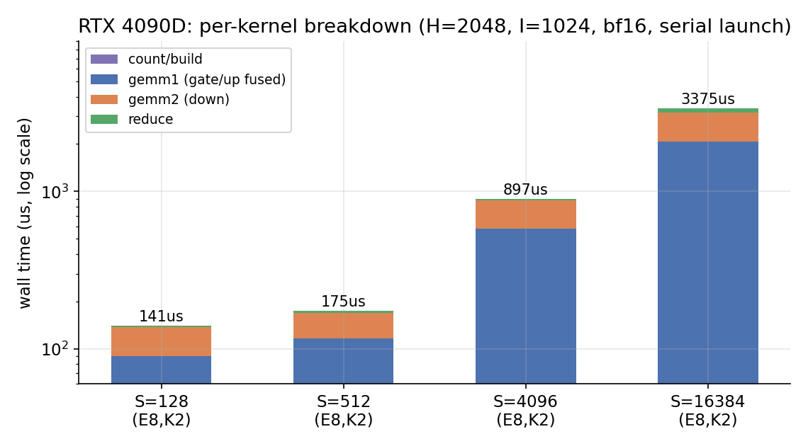
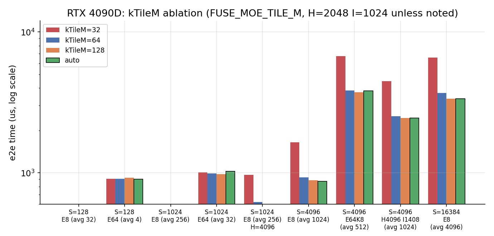
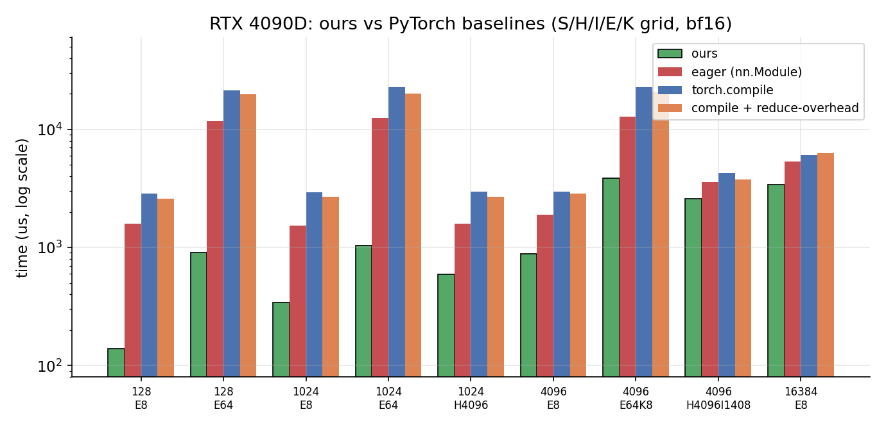
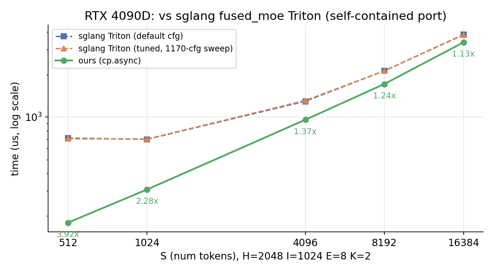

# 在 RTX 4090D 上手写 Fused MoE：sm89 的架构账本与 cp.async 连续流水线

> 一句话总结：在没有任何 Hopper/Blackwell 高级特性的消费级 Ada 卡（sm89）上，用 **mma.sync + cp.async 的 Ampere 范式**实现了一个 fused MoE 前向算子，端到端有效算力 **122 TFLOPS（bf16）＝ cuBLAS 方阵 GEMM 实测峰值的 84%**，其中 gate/up 融合 GEMM 单核 **134 TFLOPS（92%）**，topk 归约核 **≈1.0 TB/s（≈DRAM 标称带宽）**。相对 PyTorch eager **1.4–12.8x**，相对 `torch.compile`（含 reduce-overhead / CUDA graph）**最高 84x**，相对 sglang 生产 Triton MoE（本机 tuned）**1.1–3.9x**。
>
> 本文按「架构 → 实现 → 瓶颈与优化」展开，所有数据均为 RTX 4090D（114 SM / PyTorch 2.11 / CUDA 12.8）实测，复现脚本随仓库发布。

---

## 1. sm89 是一张什么样的卡：写 kernel 前的架构盘点

### 1.1 实测规格

| 项目 | RTX 4090D (sm89, AD102) | 备注 |
|---|---|---|
| SM 数 | 114 | 满血 AD102 为 128，4090D 屏蔽 |
| 每 SM | 128 FP32 core / 4× 第四代 Tensor Core / 4 warp scheduler | |
| bf16 dense 峰值（fp32 累加） | 标称 ≈147 TFLOPS，**cuBLAS 8192³ 实测 145.6** | 后文效率均以 145.6 归一 |
| 共享内存 | **100 KB/SM，单 block opt-in 上限 99 KB（101376 B）** | 决定流水线深度预算 |
| L2 | 72 MB | 消费级 Ada 的大 L2，对 gather 型访存命中率友好 |
| DRAM | 24 GB GDDR6X，384-bit @ 21 Gbps → **1008 GB/s** | reduce 核的 roofline |
| 加速时钟 | 2.52 GHz | 持续满载会热节流 ±10%，见 §3.4 的测量纪律 |

### 1.2 与 Hopper / Blackwell 的能力对照——为什么「回到 Ampere 范式」

| 能力 | sm89 (4090D) | sm90 (H100) | sm120 (5090) |
|---|---|---|---|
| MMA 指令 | `mma.sync` 16×8x16 | `wgmma` 64×N×16（warpgroup 级） | `mma.sync`（消费级 Blackwell **无 wgmma**） |
| 异步搬运 | `cp.async` (LDGSTS)，4/8/16 B | **TMA**（张量块搬运） | TMA + mbarrier |
| 共享内存/SM | 100 KB | 228 KB | 100 KB（101376 B/block） |
| 线程块簇 / PDL | 无 / **无**（sm90+） | 有 / 有 | 有 PDL |
| 本算子路径 | **cp.async 连续流水（本文）** | hpc-ops 原版：wgmma + TMA | 复用 sm89 路径 + 可选 TMA 引擎 |

这张表推出了本文全部设计决策的三条公理：

1. **没有 wgmma**：矩阵乘回到 `mma.sync m16n8k16` + `ldmatrix` 的手动分块。好消息是它与 fp16/bf16 数值通路在 sm80~sm120 全系一致——kernel 可以一套代码覆盖两代卡；坏消息是寄存器分块、双缓冲、bank 冲突全部要自己管。
2. **没有 TMA**：gmem→smem 搬运只有 `cp.async`，每线程最多 16 B、不能做张量级越界补零（只有 src-size 语义的逐字节补零）。MoE 的「按专家 gather 激活行」必须自己写成逐线程 16 B 搬运 + 谓词。
3. **smem 只有 99 KB/block**：多级流水（kStage）的深度是被预算倒推出来的，tile 形状和流水深度是一对必须联解的变量（§3.4）。

另外两条 sm89 特有的约束，后面都会用到：**PDL（Programmatic Dependent Launch）是 sm90+ 特性**，sm89 上多 kernel 流水线只能靠 stream 顺序串联；cp.async 的 `L2::128B` cache hint 在 sm89 上有效，可以预取伴随行。

### 1.3 问题定义

标准 MoE FFN 前向（Mixtral 风格，bf16，fp32 累加）：

```python
# x: (S, H)   w1: (E, 2I, H)   w2: (E, H, I)
# topk_ids: (S, K) int32   topk_scale: (S, K) fp32
gate_up = gather_rows(x, topk_ids) @ w1[e]          # (T, 2I), T = S*K（expert 排序后）
act     = silu(gate_up[:, :I]) * gate_up[:, I:]     # (T, I)
down    = act @ w2[e]                               # (T, H)
y       = weighted_sum_scatter(down, topk_scale)    # (S, H)
```

难点不在单个 GEMM，而在 **group GEMM 的动态性**：每个专家的行数 `m_e` 是 count kernel 跑完才知道的运行期数据，M 维是不规则分段；两个 GEMM 之间还有 gather、激活、scatter-reduce 三种非规则数据重排。

---

## 2. 整体实现：四段流水线与紧凑布局

### 2.1 数据流

```
topk_ids (S,K) ──┐
                 ▼
   ① count_and_build ──→ row_indices(T) / topk_pos(S,K) / cu_seqlens(E+1) / tiles(E)
x (S,H) ─────────┐
                 ▼
   ② gemm1：gate/up 配对 + silu·mul epilogue        [cp.async scatter, gather-on-load]
                 │   A: x 按 row_indices 逐行 gather；W1 gate 面板与 up 面板配对计算
                 ▼
            act_out (T, I)      ← expert 有序 compact 布局（无 padding 空洞）
                 ▼
   ③ gemm2：down                                  [cp.async multistage，激活连续]
                 ▼
            down_out (T, H)      ← compact
                 │  topk_pos / topk_scale
                 ▼
   ④ reduce ──→ y (S, H)
```

四个 kernel，三条 gmem 中间量（`row_indices`、`act_out`、`down_out`），全部在**expert 有序 compact 布局**上流动。对比 sglang Triton MoE 的 padded 布局（每个 expert 区间补齐到 BLOCK_SIZE_M 的倍数、区间间留洞），compact 布局把 footprint 压到理论下限 `T×…`，代价是 GEMM 的 M 维不再对齐 tile——这个代价由 kernel 里的行谓词与 gather-on-load 承担（§3.2/§3.5），换来大 shape 下 L2 命中率与 reduce 流量的双重收益。

小批量（`S ≤ 128`）时 ① 融合为**单 block 一次完成**（直方图→前缀和→槽位分配，cub BlockScan），少两次 launch 与两次全局同步；大批量时拆成 count → 前缀和 → build 三步以获得并行度。

### 2.2 MMA 分块（swapAB）

与 CUTLASS/hpc-ops 惯例一致，MMA 实际计算 **W @ Xᵀ**：A 操作数 = 权重 tile `(64, kTileK)`（行主序、行号即输出列，天然 ldmatrix 友好），B 操作数 = 激活 tile，C 是 `(N, M)` 的转置视图，epilogue 按 `gY(col, row)` 写回行主序 gmem。

```cpp
// csrc/fuse_moe/common/group_gemm_config.cuh
using MMA_ATOM = std::conditional_t<std::is_same_v<T, cutlass::bfloat16_t>,
                                    SM80_16x8x16_F32BF16BF16F32_TN,
                                    SM80_16x8x16_F32F16F16F32_TN>;
using TiledMMA = decltype(make_tiled_mma(
    MMA_Atom<MMA_ATOM>{},
    make_layout(make_shape(Int<2>{}, Int<4>{}, Int<1>{})),   // 8 warp
    Tile<Int<32>, Int<64>, Int<16>>{}));                      // 256 线程
```

smem 用 CuTe 的元素域 `Swizzle<3,3,3>`（K-major 8×64 atom）排布，`ldmatrix`（`SM75_U32x4_LDSM_N`）喂 MMA，无 bank 冲突；`kTileK=128` 由 `tile_to_shape` 嵌套扩展，K=64/128 双 case 共用同一套 partition 代数。

### 2.3 tile 与流水深度：一对联解的变量

M 维 tile 按负载选（`avg_tokens_per_expert = S·K/E`）：

```cpp
// csrc/fuse_moe/common/fuse_moe_params.h
if (avg_tokens_per_expert <= 48)        tm = 32;
else if (avg_tokens_per_expert >= 256)  tm = 128;
else                                    tm = 64;
```

K 维 tile 与流水深度 kStage 由 96 KB smem 预算倒推（§3.4 有完整预算表）。grid 按 `cudaOccupancyMaxActiveBlocksPerMultiprocessor` 实测值 × SM 数启动，每个 CTA 用 **horizon 线性扫描**以 O(1) 摊销代价从 `tiles[]` 拉取下一个 `(expert, tile_m, tile_n)` 任务。

---

## 3. 瓶颈分析与优化

先看时间都去哪了（`FUSE_MOE_TIME=1` 分段计时，串行 launch，3 次取中位）：

| S（E=8,K=2） | count/build | gemm1(融合) | gemm2 | reduce | 合计 |
|---:|---:|---:|---:|---:|---:|
| 128 | 4 µs | 86 µs | 47 µs | 4 µs | 141 µs |
| 512 | 12 µs | 105 µs | 53 µs | 5 µs | 176 µs |
| 4096 | 11 µs | 569 µs | 299 µs | 18 µs | 898 µs |
| 16384 | 10 µs | 2054 µs | 1112 µs | 199 µs | 3375 µs |



三个观察直接定义了后面的优化次序：**(a)** 小 batch 时四段全是十微秒级，任何一段的固定开销都直接吃掉百分比；**(b)** 大 batch 时 gemm1+gemm2 占 94%，它们的效率决定一切；**(c)** reduce 在 16384 时占 6%，且看起来贴着 DRAM 带宽——它是尾部优化点。

### 3.1 瓶颈一（小 batch）：kernel 链的固定开销

**现象**。S=512 时我们的端到端 176 µs；同形状 sglang Triton MoE（本机 tuned，自包含移植版，见 §4）要 **701.6 µs**，差 3.9x。分段看，两者 GEMM 微基水准并无 4x 差距——差距在结构：sglang 是 align + gemm1 + act + gemm2 + sum **五段式**，其中 align（生产版为 AOT 单 kernel）+ act（Triton，读 `(T,2I)` 写 `(T,I)`）都是整条链上的独立 kernel；我们只有四段，且 ② 里没有 act。

**优化**。

1. **count 三合一**（`S≤128` 单 block 融合，§2.1），把调度元数据的生产从「3 kernel + 2 次全局同步」压成 1 个 4 µs 的 kernel；
2. **消灭 act 段**：不物化 `gate_up_out (T,2I)`，激活在 gemm1 的 epilogue 里就地完成（§3.3）——这一条同时服务于小 batch（少一次 launch）和大 batch（少 2×T×I×2B 的 DRAM 往返）；
3. **PDL 的缺席与补偿**。sm89 没有 PDL，kernel 间只能 stream 顺序执行，上一 kernel 的 epilogue 与下一 kernel 的 prologue 无法重叠。补偿手段正是把重叠做进 kernel 内部——连续流水（§3.2）让 task 边界的发射不断流，相当于把「kernel 间 prologue 重叠」下沉为「task 间 prologue 重叠」。

**效果**。四段合计 141~176 µs 中 launch 间隙可忽略（分段计时 total ≈ 各段之和），vs sglang 的 3.9x 在 S=512 处确立；`torch.compile` 在小 batch 下反而更慢（guard/重启开销 2.5 ms 级），见 §4 主表。

### 3.2 瓶颈二（大 batch）：task 边界的流水线排空 → 全局 slab 连续流水

这是整个 kernel 的核心机制，也是相对「教科书式 multistage GEMM」的主要增量。

**现象与归因**。group GEMM 的任务粒度是 `(expert, tile_m, tile_n)`，一个 CTA 串行消费一串任务。教科书实现是 per-task 的 prologue-compute-epilogue 三相：进入新 task 时重填 kStage-1 个 slab、`__syncthreads`、才开始算。K 循环每 task 有 `ntile = K/kTileK` 个 slab（H=2048、kTileK=64 时 32 个），task 边界的重填相当于让流水线**排空再灌满**：以 M128/K64/S3 为例，每 task 边界有 2 个 slab 的空窗，S=16384 时 gemm1 有约 4096 个 task，空窗累计非常可观。（我们最初在 sm120 上做过 drain 版与 TMA 版的对照：**连续化后 cp.async 反超 TMA 引擎 3–15%**——TMA 版 mbarrier 相位天然跨 tile 连续，它此前的领先有一半来自 cp.async 版没做好 task 边界。这个教训写在开发日志里，机制在这里原样复用。）

**机制**。把「发射」从 task 循环里解耦出来，变成一条**以 slab 为单位、全局连续的发射流**：

```cpp
// csrc/fuse_moe/sm89/group_gemm_sm89.cuh
int issued = 0;    // 全局已发射 slab 数：stage = issued % kStage
int slab_read = 0; // 全局已消费 slab 数

auto issue_step = [&]() {
  if (iss_kk >= ntile && !iss_is_next) {   // 当前 task 的 slab 发完
    iss_is_next = true; iss_kk = 0;        // → 无缝切到预取好的下一 task
  }
  const TaskCtx &t = iss_is_next ? Tn : Tc;
  if (!t.valid || iss_kk >= ntile) return;
  load_slab(t, iss_kk, issued % kStage, iss_is_next ? rows_next : rows_cur);
  ++iss_kk; ++issued;
};

while (Tc.valid) {
  clear(tYr);
  for (int kk = 0; kk < ntile; ++kk) {
    issue_step();                    // ① 发射 slab_read + kStage - 1
    cp_async_fence();                // ② commit（含空组，与 slab 一一对应）
    cp_async_wait<kStage - 1>();     // ③ 保证 slab_read 已落地
    __syncthreads();                 // sync#1：数据全线程可见
    /* ... s2r 交错 + mma ... */
    ++slab_read;
    __syncthreads();                 // sync#2：读取完成，发射才可覆写该 stage
  }
  /* epilogue：期间下一 task 的 prologue slab 已在途 */
}
```

四个关键细节，每个都对应一类踩过的坑：

1. **wait 语义**：slab r 在迭代 r-kStage+1 发射、同迭代 fence commit，到它的 wait 之间恰有 kStage-1 个 fence，`wait<kStage-1>` 保证落地。`issue_step` **必须在 fence 之前**——放到之后 commit 会落后一个迭代，wait 不再构成保证（这是从 mixed_gemm 一路继承的正确性约束，注释里专门标了 ⚠️）。
2. **ring 安全**：迭代 i 的发射写 stage `(i+kStage-1)%kStage = (i-1)%kStage`，恰是上一迭代 ldmatrix 正在读的 stage——双 `__syncthreads` 把「读完成」与「可覆写」隔开，读与写相差 kStage-1 个迭代，天然写读分离。
3. **sC 独立区**：输出暂存 sC **不能**像传统实现那样别名 operand 区——epilogue 期间流水线仍在向 operand stage 发射下一 task 的 slab，别名会直接冲突。代价是 smem 预算里多一块 sC（§3.4 预算表已计入）。
4. **scatter 行索引驻留寄存器**：gemm1 的 A 是按 `row_indices` gather 的，行号如果放 smem，每 task 边界多一次往返。改为每线程寄存器数组 `rows_cur/rows_next` 两组滚动（发射侧最多领先 compute 一个 task，两组恰好够），发射流切 task 时行索引零等待。

**效果**。S=16384 时 gemm1（含 gather + 激活 epilogue）**2054 µs → 134 TFLOPS，为 cuBLAS 方阵 GEMM 实测峰值的 92%**；gemm2 1112 µs → 124 TFLOPS（85%）。注意这两个数是在 M 维完全不规则（专家负载二项分布、tile 带 padding 谓词）、A 侧带 gather 的条件下拿到的。

### 3.3 瓶颈三：中间量物化 → gate/up 配对 N-tile 融合

**账**。朴素实现里 gemm1 写 `gate_up_out (T, 2I)`，独立 act kernel 再读它、写 `act_out (T, I)`。S=16384（T=32768, I=1024, bf16）时：

```
多出的 DRAM 往返 = 写 (T,2I) 134.2 MB + 读 (T,2I) 134.2 MB = 268.4 MB
                 ≈ 268 µs @ ~1 TB/s ≈ 端到端的 8%
外加：一次 kernel launch + act kernel 自身的低效率（纯带宽型小核）
```

**机制**。gate 与 up 是 W1 行空间 `[0,I)` 与 `[I,2I)` 的两个 N 半区。把 gemm1 的 task 粒度从 N-tile 改为 **N-pair**：同一 CTA 同时算 gate 面板与 up 面板，共享同一 X tile——X 的 smem/L2 装载量减半，task 数减半，激活进 epilogue：

```cpp
// csrc/fuse_moe/sm89/group_gemm_sm89.cuh（group_gemm_gateup_kernel）
auto tYr_g = thr_mma.partition_fragment_C(sC);   // gate 半区累加器
auto tYr_u = thr_mma.partition_fragment_C(sC);   // up   半区累加器
...
cute::gemm(tiled_mma, tWr_g(_, _, ik), tXr(_, _, ik), tYr_g);
cute::gemm(tiled_mma, tWr_u(_, _, ik), tXr(_, _, ik), tYr_u);
...
// fragment 对齐前提：同一 tiled_mma + 同一 B 分区的两次 gemm，
// 索引 i 恒映射相同的 (m_row, n_col)，仅 W 数据源不同
for (int i = 0; i < size(tYr_g); ++i) {
  tActc(i) = static_cast<Tout>(silu(tYr_g(i)) * tYr_u(i));   // fp32 计算
}
```

双累加器 `tYr_g/tYr_u` 的 fragment 索引对齐由 CuTe 的分区代数保证——这是该融合成立的唯一前提，代码注释里专门钉死（一旦换 atom/thread 布局需要重新验证）。silu 在 fp32 累加器上直接计算后才转 bf16，避免中间二次舍入。

**代价与取舍**。双 W 面板挤占 operand smem，kStage 深度低于基线变体（M64/K64：5→3 级，M32/K64：6→4 级，见 §3.4 预算表）——由 §3.2 的连续流水补偿：task 边界不再有排空，浅一点的多级流水也能喂满 MMA。

**效果**。分段计时里 **act 段整体消失**，gemm1 以 134 TFLOPS「顺带」完成了激活。流量账预测端到端收益 ≈268 µs（8%）；开发期在 sm120 上对同结构融合做过对照实测：**2585 → 2351 µs（-9%）**，与流量账吻合——两个架构上机制收益一致。

### 3.4 瓶颈四：W 面板复用 vs padding 浪费 → kTileM 自适应

**模型**。kTileM 同时踩两个反向效应：

- **W 复用（要大）**：每个 M-tile 都要装载完整的 W 面板，W 流量 ∝ `Σ_e ceil(m_e / kTileM)`。kTileM 翻倍 ≈ W 装载次数减半。E 越大、W footprint 越大（4090D 上 E=64 时 W ≈ 806 MB，远超 72 MB L2），该效应越主导；
- **padding 浪费（要小）**：tile 覆盖 `kTileM` 行而有效行只有 `m_e mod kTileM` 时，MMA 在零行上空转。avg tokens/expert 小于 kTileM 时浪费比例最高达 `1 - avg/kTileM`；同时大 tile 减少 task 数，小 batch 时直接饿死 114 个 SM。

**实测消融**（`FUSE_MOE_TILE_M` 强制，同 session 冷却间隔，µs）：

| shape（avg=S·K/E） | tile 32 | tile 64 | tile 128 | auto（选择） |
|---|---:|---:|---:|---:|
| S=128, E=8（avg 32） | **131.8** | 162.5 | 198.6 | 141.8（32） |
| S=128, E=64（avg 4） | 910.4 | 910.3 | 922.0 | 901.1（32） |
| S=1024, E=8（avg 256） | 468.8 | **254.3** | 273.8 | 274.7（128） |
| S=1024, E=64（avg 32） | 1009.7 | 991.0 | **977.4** | 1025.6（32） |
| S=1024, H=4096（avg 256） | 967.4 | 619.6 | **573.1** | 587.8（128） |
| S=4096, E=8（avg 1024） | 1646.0 | 929.8 | 886.6 | **872.0**（128） |
| S=4096, E=64, K=8（avg 512） | 6731.9 | 3845.9 | **3741.1** | 3828.0（128） |
| S=4096, H=4096, I=1408（avg 1024） | 4474.4 | 2523.3 | **2446.1** | **2445.1**（128） |
| S=16384, E=8（avg 4096） | 6575.1 | 3682.8 | **3368.0** | **3371.2**（128） |



数据与模型吻合得很干净：avg=32 时强制 128 比 32 慢 **51%**（padding 空转 + task 太少）；avg=4096 时强制 32 比最优慢 **95%**（W 面板装载次数 ×4）；E=64 的 W-bound 形状上即使 avg=32，128 也反超（W 流量主导一切）。一个诚实的方法论脚注：avg=256 边界附近 64 与 128 的单次消融差异（±7%）经背靠背受控复测证实为时钟噪声——同形状同进程下 M128 反而优 7%，与单次扫描的结论方向相反、幅度相同，符号不稳定即噪声。当前阈值 `avg≤48→32 / ≥256→128` 的两条主干规则（小 avg 怕 padding、大 avg 要 W 复用）在全部九形状上稳健成立，边界带的剩余空间 <噪声底。

**smem 预算表**（96 KB 预算，sC 预留区计入；kStage = 预算 / 每 stage operand）：

| 变体 | M32/K64 | M64/K64 | M64/K128 | M128/K64 | M128/K128 |
|---|---|---|---|---|---|
| 基线（X+W） | **6 级**（80 KB） | **5 级**（88 KB） | 2 级（80 KB） | **3 级**（90 KB） | 112 KB ✗ → 降级 K64 |
| gateup（X+2W） | **4 级**（80 KB） | **3 级**（82 KB） | 104 KB ✗ | 2 级（82 KB） | 148 KB ✗ |

```cpp
// csrc/fuse_moe/sm89/group_gemm_sm89.cuh（group_gemm_gateup_fused_async）
constexpr int kStage = [] {
  constexpr int bps = (kTileM + 2 * 64) * kTileK * 2;        // X + 双 W 面板
  constexpr int sc  = (kTileM < 64 ? 64 : kTileM) * 64 * 2;  // sC 预留区
  constexpr int s   = (96 * 1024 - sc) / bps;
  return (s > 6) ? 6 : ((s < 2) ? 2 : s);
}();
```

这里有个值得记录的坑：sC 预留区按 `(64, max(M,64))` 而不是 `(64, M)` 分配。原因是 TiledMMA 的 C fragment 覆盖面**恒为 64×64、与 kTileM 无关**（`Tile<32,64,16>` × 8 warp 的组合决定），M32 时 r2s 分区会写到 sC 逻辑边界之外——不预留就是静默的 smem 越界写。同理 M128/K128 组合（112 KB）超预算时 dispatch 显式降级 K64，**绝不静默 launch**（超限 launch 在部分驱动上是静默失败、输出 NaN，这类 bug 比崩溃难查一个量级）。

### 3.5 瓶颈五：尾段带宽——把每一字节都做成 16 B

三个尾段优化，每个都对应一行实测：

1. **epilogue 16 B 向量化**：fp32 累加器 → bf16 → sC（专用区，§3.2）→ 行谓词 `uint4` 直写 gmem。`n%64==0` 保证列恒在界内，行谓词整行判定，尾部零拷贝。
2. **reduce 打满 DRAM**：`out[s] = Σ_j scale[s,j] · down_out[topk_pos[s,j]]`，topk 位置/权重先驻 smem，内层 8 元素向量化。S=16384 时搬运 201.3 MB（读 134.2 + 写 67.1）耗时 199 µs → **1.01 TB/s，≈ 1008 GB/s 标称带宽**（部分 L2 命中）。这一段已经没有算法级空间，剩余收益只能靠与 gemm2 epilogue 融合（需接受 bf16 累加精度损失，未启用）。
3. **scatter 装载的三个细节**（gemm1 的 A 侧 gather）：

```cpp
// csrc/fuse_moe/sm89/group_gemm_sm89.cuh（scatter_load_x_tile）
asm volatile("cp.async.cg.shared.global.L2::128B [%0], [%1], %2, %3;\n" ::"r"(...),
             "l"(gmem_ptr), "n"(16), "r"(src_size));   // src-size 语义
```

   - 逐线程 16 B `cp.async.cg`（绕 L1、L2 128 B 预取——gather 行相邻概率高，hint 显著提升 DRAM 效率）；
   - **src-size 谓词零填充**：越界行 `src_size=0`，硬件拷 0 字节即零填充，语义等价 ZFILL 且免去分支；
   - smem 目的地址取自 `G2SCopy::partition_D`——swizzle 感知，手写 asm 也不会写破 bank 排布。行索引来自寄存器驻留的 `rows_cur/rows_next`（§3.2）。

---

## 4. 端到端结果

### 4.1 vs PyTorch 基线

基线为 Mixtral/HF 风格 `nn.Module`（per-expert `nn.Linear` + `index_add` 路由归约），同一 run 内测 eager / `torch.compile` / compile+reduce-overhead（CUDA graph）/ fullgraph+graph 四档：

| Shape (S,H,I,E,K) | custom µs | TFLOPS | eager µs | vs eager | compile µs | comp+RO µs | FG+graph µs | vs FG |
|---|---:|---:|---:|---:|---:|---:|---:|---:|
| (128,2048,1024,8,2) | 138.5 | 23.3 | 1586.2 | **11.5x** | 2855.3 | 2571.8 | 11628.3 | **84.0x** |
| (128,2048,1024,64,2) | 909.4 | 3.5 | 11657.9 | **12.8x** | 21404.4 | 19741.8 | 12643.6 | **13.9x** |
| (1024,2048,1024,8,2) | 342.9 | 75.2 | 1523.3 | 4.4x | 2916.3 | 2694.6 | — | — |
| (1024,2048,1024,64,2) | 1040.6 | 24.8 | 12467.8 | **12.0x** | 22591.6 | 20087.0 | — | — |
| (1024,4096,1024,8,2) | 591.2 | 87.2 | 1588.7 | 2.7x | 2956.7 | 2698.0 | — | — |
| (4096,2048,1024,8,2) | 886.9 | 116.2 | 1888.4 | 2.1x | 2963.4 | 2859.2 | — | — |
| (4096,2048,1024,64,8) | 3841.4 | 107.3 | 12736.0 | 3.3x | 22653.7 | 20735.7 | — | — |
| (4096,4096,1408,8,2) | 2570.8 | 110.3 | 3561.0 | 1.4x | 4249.3 | 3741.1 | — | — |
| (16384,2048,1024,8,2) | 3387.0 | 121.7 | 5365.7 | 1.6x | 6032.6 | 6263.0 | — | — |



大 shape 有效算力 **107–122 TFLOPS**；相对 eager **1.4–12.8x**；`torch.compile` 对这类数据依赖控制流的 MoE 结构优化乏力（guard + 逐 expert 小 GEMM 无法融合），小 batch 下比 eager 更慢，fullgraph+CUDA graph 也只到 13.9x。（跨 run 绝对值受时钟浮动影响 ±10%，同表四列为同一 run 测得，比值可靠。）

### 4.2 vs sglang Triton MoE（生产实现，本机 tuned）

sglang 侧为逐字提取的自包含移植（kernel 与上游一致；tuned config 由 1170 候选网格全扫产生，default 启发式与 tuned 均列出）：

| S | ours µs | ours TF | sglang-def µs | sglang-tuned µs | vs def | vs tuned |
|---:|---:|---:|---:|---:|---:|---:|
| 512 | 178.8 | 72.1 | 709.2 | 701.6 | 4.0x | 3.9x |
| 1024 | 306.8 | 84.0 | 695.5 | 698.2 | 2.3x | 2.3x |
| 4096 | 956.3 | 107.8 | 1293.4 | 1310.5 | 1.4x | 1.4x |
| 8192 | 1714.4 | 120.2 | 2125.9 | 2122.8 | 1.2x | 1.2x |
| 16384 | 3381.5 | 121.9 | 3838.9 | 3818.6 | 1.1x | 1.1x |



差距结构在 §3.1 已分解：小 batch 是 kernel 链结构差（五段 vs 四段、act 段、padded 布局），大 batch 收敛到 GEMM 本体效率差（连续流水 + gate/up 融合 vs 通用 tile）。

### 4.3 效率归一（S=16384, H=2048, I=1024）

| 环节 | 吞吐 | 归一基准 | 效率 |
|---|---:|---|---:|
| gemm1（gather + 融合激活） | 133.8 TFLOPS | cuBLAS 8192³ = 145.6 TFLOPS | **92%** |
| gemm2（down） | 123.6 TFLOPS | 同上 | 85% |
| reduce | 1.01 TB/s | DRAM 标称 1008 GB/s | **≈100%** |
| 端到端 | 122.3 TFLOPS | 同上 | **84%** |

在一个 M 维不规则、A 侧 gather、epilogue 带逐元素激活的 group GEMM 上拿到方阵 GEMM 92% 的效率，我们认为是这套「连续流水 + 配对融合 + tile 自适应」组合的直接证据。

> **后记（发布后补）**：本文发布后用 ncu 做了 gemm2 那 15% 差距的归因（同 16.67% 占用率、L2 命中 97%、DRAM 15%——不是带宽问题，是低占用下浅流水的延迟掩盖问题），据此把 gemm1 的配对杠杆复制到 gemm2（相邻 N-pair，每 task 覆盖 128 列，per-slab MMA 密度 ×2），全 shape 谱系 e2e 再提 2–3%，端到端 125 TF（86%），5090D 同路径峰值 194.3 TF。详见开发日志 Phase 7。

---

## 5. 复盘

**方法论上值得沉淀的三条**：

1. **分段计时先于优化**。`FUSE_MOE_TIME=1`（串行 launch + event 打点）把「慢」翻译成「哪一段慢」，本文 §3 的四个瓶颈全部由它定位。代价是 PDL 重叠被关闭——分段归因与重叠执行天然互斥，两个模式都要有。
2. **消融要有对照组，且要控制时钟**。tile 消融九形状 × 四档在同一个 session 里以 45 s 冷却间隔跑完；4090D 持续满载会热节流，我们曾在 tuning 扫参中观察到 1.4–2.2x 的绝对时间膨胀（详见开发日志），短突发 benchmark 复核是扫参结果可信的必要条件。
3. **host 探针裁决 layout 争议**。CuTe 的 partition/layout 代数多为 constexpr，可以在 CPU 上直接编译打印。坐标语义、模式顺序的每个疑问都值得一个 30 行探针——比在 GPU 上盲调快一个量级。

**遗留与边界**：

- **无 PDL**：sm89 上四段流水线只能 stream 顺序串联，kernel 间 prologue 重叠不存在；这正是把重叠下沉到 task 级（§3.2）的动机，但 count 段与 gemm1 prologue 之间仍有数微秒级的空窗；
- **kTileM 边界带处于噪声底**：avg=256 附近的 64/128 差异经受控复测证实为时钟噪声（符号不稳定，§3.4 脚注），阈值主干规则全形状稳健；若未来引入新架构或极端路由分布（如 E=1、重度倾斜），值得用解析 cost model（W 复用 ∝ ceil(m_e/M) vs padding 期望的 balls-in-bins 项）替代阈值表——但那是为了可移植性与 pathological shape 防护，而非现有形状的性能；
- **K 约束**：`k%64==0`（`n%64==0`）由 op 层校验，非 64 倍数 K 需要回退路径；
- **精度**：中间量以 bf16 落盘（与真实 bf16 模型一致的数值路径），MMA 累加与激活计算均为 fp32；fp8 版本不在本仓库范围。

---

*实现：`csrc/fuse_moe/`（sm89 cp.async 家族 `sm89/group_gemm_sm89.cuh`，调度与非 GEMM kernel `common/moe_kernels.cuh`，架构分发 `fuse_moe_launch.h`）；基准：`benchmark/benchmark_fuse_moe.py`（PyTorch 基线）、`benchmark/benchmark_fuse_moe_vs_sglang.py` + `benchmark/sglang_triton_moe/`（sglang 对照，自包含移植）；测试：`tests/test_fuse_moe.py`（21 用例）。完整优化历程（含 sm120 TMA 引擎的对照实验）见 [docs/fuse_moe_porting_and_optimization.md](fuse_moe_porting_and_optimization.md)。*
