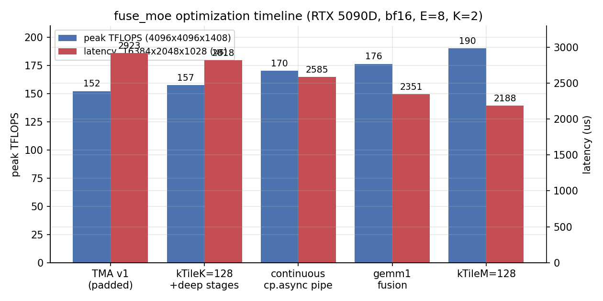
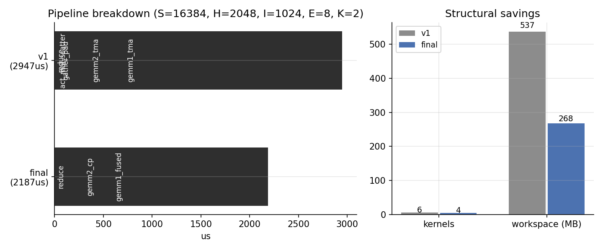
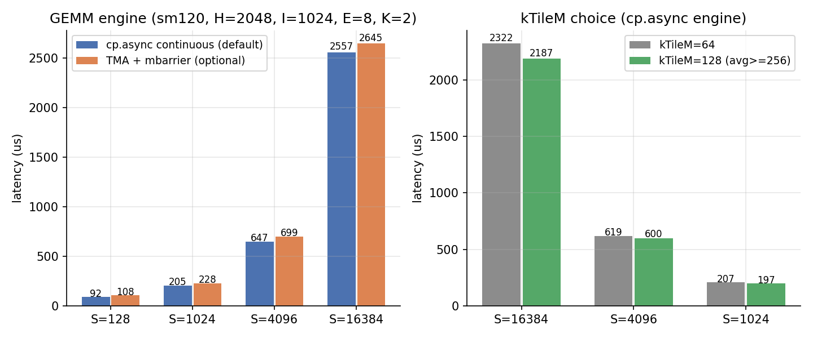

# fuse_moe 在 sm89 / sm120 上的移植与优化全记录

> **硬件**：RTX 5090D（GB202，sm_120a，170 SMs，L2 96MB，mma.sync bf16 峰值 **209.5 TFLOPS**，cuBLAS bf16 峰值 235 TFLOPS）；对照机 RTX 4090D（sm_89，128 SMs）
> **软件**：CUDA 12.8 / PyTorch / CUTLASS+CuTe（thirdparty）
> **算子**：MoE FFN 前向融合——`y[s] = Σ_j topk_scale[s,j] · (Down_ej @ silu(GateUp_ej @ x[s]))`，bf16/fp16 输入、fp32 累加，单 GPU，无 fp8 量化
> **最终结果**：大 shape 有效算力 **170–190 TFLOPS**（mma.sync 峰值的 81–91%）；vs PyTorch eager **1.9–22.9x**，vs `torch.compile` **1.6–2.4x**，vs compile+CUDA graph **最高 159.6x**（小 batch 大 E 场景）；流水线 kernel 数 6 → 4，workspace 537 → 268 MB

---

## 目录

1. [背景与目标](#1-背景与目标)
2. [数据流与整体设计](#2-数据流与整体设计)
3. [优化历程时间线](#3-优化历程时间线)
   - [Phase 1：从 hpc-ops (sm90) 移植——padded 布局 + TMA](#phase-1从-hpc-ops-sm90-移植padded-布局--tma)
   - [Phase 2：kTileK=128 与深流水的解锁](#phase-2ktilek128-与深流水的解锁)
   - [Phase 3：TMA 任意行坐标——padded 布局的终结](#phase-3tma-任意行坐标padded-布局的终结)
   - [Phase 4：连续流水 cp.async——引擎逆转](#phase-4连续流水-cpasync引擎逆转)
   - [Phase 5：gemm1 融合——gate/up 配对 N-tile](#phase-5gemm1-融合gateup-配对-n-tile)
   - [Phase 6：kTileM=128——W 面板流量减半](#phase-6ktilem128w-面板流量减半)
4. [最终性能全景](#4-最终性能全景)
5. [与 sglang Triton MoE 的对比](#5-与-sglang-triton-moe-的对比)
6. [踩坑实录（可复用的教训）](#6-踩坑实录可复用的教训)
7. [经验总结](#7-经验总结)

---

## 1. 背景与目标

推荐系统的 MoE 层（如 DeepSeek/Mixtral 风格 FFN）在单卡推理中是纯访存+算力混合瓶颈：每个 token 经 top-k 路由到 k 个专家，每个专家一次 gate_up GEMM + 一次 down GEMM。PyTorch eager 的实现需要 gather → 2×E 个小 GEMM（或 loop 逐 expert）→ scatter → 加权求和，中间物化大量临时缓冲；`torch.compile` 的 fusion 无法穿透 GEMM。

上游参考 [hpc-ops](https://github.com/meituan-hpc/hpc-ops) 的 `src/fuse_moe/sm90` 实现（wgmma + TMA + fp8），本仓库的目标是：

- **移植到 sm89（RTX 4090D）与 sm120（RTX 5090D）**——两者都没有 wgmma（sm120 consumer 砍掉了），计算骨架统一为 sm80 `mma.sync` 16x8x16；
- **去掉 fp8**：x/权重 bf16/fp16 直入，MMA fp32 累加（推荐场景精度优先）；
- **架构分层**：仿本仓库 FA 的 `common/ smXX/ launch.h` 四层结构，方便后续加新架构；
- **单 GPU 全场景最优**：从小 batch（S=128, E=64 的极端倾斜）到大批量（S=16384）。

---

## 2. 数据流与整体设计

```
① count/build_indices    topk_ids (S,K) → seqlens/cu_seqlens (E)、row_indices (T)、
                         topk_pos (S,K)、tiles (E)        [T = S×K，expert 有序 compact 布局]
② gemm1 融合 (cp.async)  x[row_indices] @ W1[e]ᵀ 的 gate/up 两个 N 半区配对计算，
                         epilogue 直接 silu(gate)·up → act_out (T, I)
③ gemm2 (cp.async)       act_out @ W2[e]ᵀ → down_out (T, H)
④ reduce                 y[s] = Σ_j topk_scale[s,j]·down_out[topk_pos[s,j]] → (S, H)
```

架构分层（`csrc/fuse_moe/`）：

| 层 | 文件 | 职责 |
|---|---|---|
| op | `fuse_moe_op.cu` | 校验 / workspace / 填 `FMOE_params` / 调 launch，零架构感知 |
| 分发 | `fuse_moe_launch.h` | 编译期 `FA_HAS_*` × 运行期 `gpu_major()` 双重校验，策略内封家族入口 |
| common | `common/` | count/act/reduce kernels、GEMM traits、params、PDL 工具 |
| sm89 | `sm89/group_gemm_sm89.cuh` | cp.async 家族（sm80+ 通用，sm120 默认引擎亦复用） |
| sm120 | `sm120/group_gemm_sm120.cuh` | TMA + mbarrier 家族（`FUSE_MOE_TMA=1` 可选引擎） |

关键设计决策（后文按时间线展开其来历）：

- **compact 直读**：激活始终按 expert 有序 compact 布局流动，无 padded 空洞；
- **gemm1 gate/up 配对融合**：同一 CTA 同时算 W1 的 gate 面板与 up 面板（共享 X tile），epilogue 直接完成 silu·mul；
- **跨 tile 连续流水**：slab 发射流全局计数，task（tile）边界不排空；
- **swapAB MMA**：`mma(W, Xᵀ)`，A=W（每 expert 独立权重，EVICT_LAST 跨 m-tile 复用）、B=X（流式）。

---

## 3. 优化历程时间线

### Phase 1：从 hpc-ops (sm90) 移植——padded 布局 + TMA

sm90 原版的关键机制是 **device 侧 tensormap 修改**（`fence.proxy.tensormap` / `tensormap.replace`）：每个 expert 一个 TMA descriptor，extent 恰为 `(m_g, k)`，OOB 补零天然按 expert 边界生效。

**sm120a 实测堵死了这条路**：ptxas 接受这些 PTX 的语法，但硬件执行 illegal instruction。替代方案是 **padded 布局**：gather 阶段把激活物化成「每 expert 区间从 kTileM 对齐行开始」的布局（区间间留洞），A 用一个覆盖全局的全局 descriptor，坐标恒为整数 tile 索引。

这一版跑通后（**152 TFLOPS 峰值**），分段计时暴露了主要开销：`gather_pad` 227µs（2×T×H×2B 的额外 DRAM 往返）+ `act_mul_scatter` 170µs。

> 为什么不直接用 TMA 的 OOB？——OOB 相对的是 descriptor 里整张张量的 shape，不是每个 expert 的边界；expert 行数 `m_g` 是 count kernel 在 GPU 上才算出来的运行期数据，host 构建 descriptor 时不存在。「pad 换坐标表达能力」详见 [第 5 节](#51-tma-oob-补零救不了-per-group-的尾部)。

### Phase 2：kTileK=128 与深流水的解锁

SW128 swizzle atom 是 (8, 64)：kTileK=128 时 K 模式被 `tile_to_shape` 分解成嵌套 (64, 2)，TMA 坐标同样分解，直接 partition raw tensor 会 rank-mismatch。解法（FA sm120 同款模式的推广）：先 `local_tile` 展开自由 tile 模式，再 `partition_S/D`，最后 `group_modes<0,3>` 收敛坐标子模式——K=64/128 双 case 通用。

配 kStage 按 smem 预算自适应（96KB / 每 stage operand 尺寸，cap 6）：每 slab mma 工作量翻倍、barrier 发射开销减半，峰值 **152 → 157.4 TFLOPS**。

> 一个 host 端 layout 探针技巧：`make_tma_copy` + `partition` 全是 constexpr 可在 CPU 上跑——写小 cpp 用 g++ 编译，直接打印 TMA 坐标张量的 layout/坐标语义，比在 GPU 上盲调快一个量级。本项目用它先后裁决了「B 的模式顺序是 `(TMA,nn,nk,E)`（E 在最后！）」和「row-shift 的坐标 = `(itile_k·kTileK, r0+itile_m·kTileM)`」两个关键问题。

### Phase 3：TMA 任意行坐标——padded 布局的终结

重新审视「为什么要 pad」后发现了被忽视的自由度：**TMA 坐标本身就是元素单位，box 起点可以是任意行**。原实现用 tile 索引只是 `partition` 代数的产物，不是硬件约束。实现是每 group 一次坐标基平移：

```cpp
// 机制与 cute::tma_partition 内部 multicast 的 domain_offset 同源
Tensor tAg_g = make_tensor(tAg.data() + make_coord(_0{}, start_token), tAg.layout());
```

host 探针逐 case 验证坐标后落地：gemm2 的 A=act_out（流水线自己写出的 compact 中间量）恒走 TMA 直读，`act_mul_scatter` 退回普通 `act_mul`，padded workspace 与 `cu_seqlens_pad` 全部删除。gemm1 的 A=x 是 token 序（group 行按 row_indices 散列），TMA 矩形 box 无法间接寻址——这是本质约束，物化（gather）与不物化（cp.async 查表）的取舍后来在 Phase 4 有了明确答案。

### Phase 4：连续流水 cp.async——引擎逆转

把 gemm1 切到 cp.async scatter（gather-on-load）后与 TMA 引擎做全 shape 对照，发现 cp.async 落后的根源不在指令本身，而在 **task（tile）边界流水排空**：旧实现每 task 串行重填 prologue 的 kStage-1 个 slab、row_indices 走 smem 往返、双 sync。TMA 版的 mbarrier 相位天然跨 tile 连续，这正是它此前的优势来源。

对齐该语义重写 cp.async kernel：

- slab 发射流全局计数（`stage = cnt % kStage`），task 边界不排空——epilogue 期间下一 task 的 slab 已在途；
- scatter 行索引驻留寄存器（cur/next 两组滚动预取），消灭 smem 往返；
- sC 独立 smem 区 + 16B 向量化 epilogue。

结果 **cp.async 全面反超 TMA 引擎 3–15%**（92 vs 108µs @S=128 … 2557 vs 2645µs @S=16384），sm120 默认引擎随之切换（TMA 保留为 `FUSE_MOE_TMA=1` 可选路径）。教训：**比较两种引擎前，先确认两者的流水线连续性等价**——TMA 早期领先的一部分其实是「cp.async 的 task 边界没做好」贡献的。

### Phase 5：gemm1 融合——gate/up 配对 N-tile

GEMM 本体到 ≈180 TFLOPS（mma.sync 峰值的 86%）后，转向结构性省流量：gate 与 up 是同一输出行的两个 N 半区（W1 行 `[0, I)` 与 `[I, 2I)`），**配对计算**让同一 CTA 共享同一 X tile（X 装载量减半、task 数减半），双累加器在 epilogue 直接 `silu(tYr_g(i)) · tYr_u(i)`——fragment 索引 i 在同一 tiled_mma + 同一 B 分区的两次 gemm 中恒映射相同 (m_row, n_col)。

`gate_up_out (T, 2I)` 缓冲与独立 act_mul kernel 整体消灭（省 2×T×I×2B DRAM 往返），16384 case 端到端 **2585 → 2351µs**，峰值 **176.2 TFLOPS**。

### Phase 6：kTileM=128——W 面板流量减半

当年 TMA 版的 kTileM=128 存在「输出 ≈6 个元素恒 0」的悬案（S=128 复现、S=129 反常通过）。将其加到连续流水 cp.async 结构上后发现**不复现**——且大 shape 的 6 个 ≈0.15 误差元素经 M64 对照判定为合法 bf16 量化尾部（M64 强制运行给出逐位相同输出）。

kTileM=128 将每 M-tile 装载的 W 复用面扩大一倍（W 流量随 task 数减半），avg≥256 启用后：

- 16384 case：2322 → **2187µs**（gemm1_fused 1432 → 1322µs）
- 4096×4096×1408：1633 → **1490.8µs，190.1 TFLOPS**（mma.sync 峰值的 91%）

### Phase 7：ncu 归因 gemm2 延迟掩盖不足 → 相邻 N-pair（TileN=128）

sm89 移植完成后的后续优化（4090D，ncu 2025.1，sudo 计数器权限）。

**归因**（S=16384，gemm1 vs gemm2 对照）：两者占用率同为 16.67%（smem 限制每 SM 仅驻 1 CTA，8 warps），带宽均不缺（gemm2 L2 命中 97.1%、DRAM 15%）——gemm1 的 92% vs gemm2 的 85% 差在**每 slab 的 compute 密度**：gemm1 双 MMA（gate/up 配对）共享一次装载，同样的 kStage 深度下延迟掩盖预算等效翻倍；gemm2 单 MMA + kStage=3，每发射指令等待 16.26 周期。**不是带宽问题，是延迟掩盖问题**。

**方案**：把 gemm1 的配对杠杆复制到 gemm2——每 task 覆盖相邻两个 64 宽 N 面板（共享同一 X tile / 同一 smem stage），per-slab MMA 密度 ×2。实现零新骨架：`group_gemm_gateup_kernel` 泛化为 `kPairGateUp × kScatterA` 双模板维（gate/up 半区配对 scatter / 相邻 N-pair 连续 A），预算同公式（M64/K64→S3、M128/K64→S2）。默认启用，`hidden%128!=0` 自动回退，`FUSE_MOE_TILE_N=64` 强制回基线。

**实测**（4090D，全 shape 谱系 gemm2 单核 -6.7~-7.6%，e2e -2.3~-2.7%）：

| S (H=2048) | gemm2 旧 | gemm2 N-pair | e2e 旧 | e2e 新 |
|---:|---:|---:|---:|---:|
| 512 | 59µs | 57µs | 186µs | 184µs |
| 1024 | 106µs | 98µs | 315µs | 306µs |
| 4096 | 341µs | 315µs | 990µs | 965µs |
| 16384 | 1233µs | 1151µs | 3713µs | 3627µs |

5090D 同路径受益：16384 case 2187→2133µs（193.3 TF），峰值 190.1→**194.3 TF**。一个测量教训：首轮 full benchmark 中 (4096,4096,1408) 显示 N-pair 慢 3.5%，三轮背靠背复测实为**稳定快 2.0%**（旧基线 run 恰逢高 boost 时段，时钟漂移 6%）——单次跨 run 对比在 ±5% 量级时必须复测。

### Phase 8：ncu 源级归因——LDL 寄存器溢出与 r2s bank 冲突双修

4090D 上的后续优化（ncu 2025.1，S=16384 稳态，detailed set + `--page source`
逐指令 stall 采样 + host 探针）。

**归因**（gemm1/gemm2 均 M128/K64/S2、occupancy 16.7%、HMMA pipe 实际占用
~85%（fp32-acc 口径；ncu 的 42% 系按 fp16-acc 双倍率峰值归一）——不是带宽
问题（long_scoreboard 0.5、DRAM 9-16%），剩余 ~15% pipe-idle 的构成：
1. **barrier stall 3.55/issue（gemm1）**：71.5k 采样集中在 K 循环回边分支
   （sync#2 后）与 slab 首个 LDSM（sync#1 后）——sync 到达偏斜；
2. **SASS 循环头出现 LDL.64/STL**——`rows_cur/rows_next` 数组经 `const int*`
   指针形参（调用侧还有 `cond ? rows_next : rows_cur` 三元选择）与 TaskCtx
   引用穿透 lambda 边界，ptxas 据此取址降级 local memory，K 循环头每迭代
   重载，其 L1/L2 可变延迟正是 sync 偏斜的主要来源；
3. **r2s 的 8 路 bank 冲突**：host 探针（g++ 编译 CLayout 代数）证实 warp 内
   32 线程访问模式为 (n, m) = (tid/4, 2·(tid%4)+v0)、地址 n + 64m——sC 的
   M-stride 64×2B = 128B ≡ bank 周期，m 维各行全落同一 bank 组（ncu 计
   6.37M 过量 wavefront；但 kernel 非吞吐受限，实测贡献小）。探针同时证伪
   了「fragment 内 (2i,2i+1) 为 n 相邻对」的假设（实为 m 相邻对，同 n 相邻
   行）——寄存器直写 gmem 的 4B 打包 epilogue 因此不可行。

**修复**（零配置漂移：所有 kStage/k128 门控结果改前改后完全一致）：
- `SmemLayoutC` M-stride 64→**72**（144B 行距，保持 16B 对齐；bank =
  (n/2 + 36m) & 31 随 m 展开互异，相邻 n 对共字由硬件写合并）；
- **寄存器驻留**：`scatter_load_x_tile` 数组形参改 `const int (&)[N]`、
  `load_slab` 的 TaskCtx 改按值传递、`issue_step` 改 if/else 双路直传（消灭
  指针退化与引用三元选择）、`pull_task` 改返回值语义。ncu 复查：local_op_ld
  = 0，gemm1 寄存器 171→198（rows 数组入驻）、gemm2 168→154，
  long_scoreboard 0.5→0.10。

**实测**（4090D，FUSE_MOE_TIME 分段计时稳态中位，µs）：

| shape | gemm1 旧→新 | e2e 旧→新 | gemm1 Δ |
|---|---|---|---|
| 512 | 112→105 | 185→179 | **-6.3%** |
| 1024 | 193→184 | 308→299 | **-4.7%** |
| 4096 | 622→600 | 968→943 | **-3.5%** |
| 16384 | 2275→2205 | 3638→3559 | **-3.1%** |
| 4096×4096×1408 | 1703→1652 | 2639→2589 | **-3.0%** |
| 4096,E64,K8 | 2520→2438 | 3978→3890 | **-3.3%** |

全 shape e2e **-1.9~-3.2%**，gemm1（scatter 路径，溢出最重）收益最大、小
batch 最显著——与归因方向一致；gemm2（无 rows 数组）仅 TaskCtx 受益。
sglang 对比基准无回归：16384 e2e 3225µs = **127.8 TF**（cuBLAS 同 session
峰值 144.4 的 88.5%），vs sglang-tuned 1.19–4.22x。方法论：**逐指令 stall
采样比聚合比率多挖出一层**——聚合视角只见 barrier 高，源级才看到循环头
LDL；host 探针继续裁决 layout 争议（本次同时证实一个假设、证伪一个假设）。

### Phase 9：单 sync 协议实验——正确但 -4%，否决

Phase 8 后 barrier stall 仍 3.4-3.6/issue（双 __syncthreads/迭代的到达偏斜）。
实验假设：把发射从迭代顶（fence 前）挪到 sync 之后，让唯一 sync 同时承担
「slab 可见」与「上一迭代读完成」——sync 减半且协议论证完备（wait<kStage-2>
的「除最近 N 组外全部完成」语义；发射目标 stage 的读取程序序先于 sync）。

**结果**：21/21 正确性通过，但全 shape 一致退化 3.9-4.5%（gemm1 +4.3%、
gemm2 +3.8%），规律性极强——协议级效应，立即回滚（md5 复核恢复 Phase 8 
状态，回归 21/21、性能复原）。

**机制归因**（失败原因比成功更值得记录）：双 sync 里的 sync#2 不是纯开销——
它定义了发射窗口的边界。旧协议 issue 在迭代最顶部，拷贝窗口 = 完整迭代
（wait+sync+compute ≈ 4376 cyc）；单 sync 的 issue 在 sync 后，窗口只剩
compute 相位（≈3700 cyc）。省 1 个 sync（~100-300 cyc）换来窗口缩短
~600 cyc——L2 延迟波动（97% 命中但 ~700-900 cyc）下 wait<kStage-2> 对
最旧组零在途余量，空等直接暴露。**issue 置顶（迭代最顶、fence 前）是
拷贝窗口最大化的结构最优位置**；消 sync 必须与加深 kStage 联动才可能
保窗口，而 M128/K64 的 smem 预算装不下 kStage=3（需 116KB）——该路径
在 sm89 上被架构封死。

由此确认 Phase 8 后的 sync 结构已在最优点附近：剩余 ~15% pipe-idle 由
HMMA 饱和度 85% × LDSM/HMMA 依赖链的物理延迟构成，M128/S2 的结构性
天花板。后续空间仅剩 reduce×gemm2 融合（bf16 累加精度取舍，未启用）。

### Phase 10：reduce 结构性融合实验——atomic epilogue 双机净负，否决但保留

Phase 9 确认 gemm 的 sync 结构已到最优点后，转向尾段。ncu 实测独立 reduce kernel
（S=16384 / E64K8）DRAM 利用率 **94.8% / 93.5%**、L2 命中 33.6% / 11.2%——
standalone 无优化空间，唯一剩余路径是结构性消灭流量：gemm2 epilogue 直接
`atomicAdd(scale × y)` 加权累加到 out，彻底消灭 down_out 的写+读往返
（T×H×2B ×2）与独立 reduce kernel。

**实现**（完整可用，双机 21/21 通过含 duplicate/sparse 边界）：
- prep 折叠进 gemm1 kernel 开头：grid-stride 清零 out + 由 topk_pos 反散射
  构建 row_scale[t] = {token, scale} 反向映射（零额外 kernel/launch；顺序由
  kernel 边界栅栏保证）；
- gemm2 双变体（wide-N 双面板 / 非 wide 回退）各加融合 epilogue 分支：
  row_scale 反查 → fp32 缩放（bf16×bf16 乘积在 fp32 精确、单次 RN 舍入，与
  独立 reduce 数值路径等价；K=2 舍入次数同为 2 次）→ 2 元素打包原子累加；
- 实验结论：双机净负，代码已移除（见下）。

**实测（两台机器均净负，否决默认启用）：**

| 机器 | 机制 | 结果 |
|---|---|---|
| 4090D (sm89) | `atomicAdd(__nv_bfloat162)` 为 **sm90+ 特性**，nvcc 对 sm_89
  生成 CAS 重试循环模拟（正确但每次原子 = LDG+FADD+ATOM.CAS 循环） | gemm2
  1147→1794µs（**+57%**），e2e +13.7%，灾难性 |
| 5090D (sm120) | 原生 bf16x2 red，但 16384 shape 需 33.5M 次原子（≈42G
  ops/s）**贴 L2 RMW 吞吐墙** | gemm2 672→808µs（+20%），吃掉 100%+ 的
  reduce 节省（133µs）；全 shape e2e 净负 0.4~5.6% |

5090D 背靠背 A/B（同 session 稳态中位，µs）：

| shape | 基线 e2e | 融合 e2e |
|---|---:|---:|
| 4096 | 592 | 625 |
| 16384 | 2126 | 2142 |
| 4096×4096×1408 | 1465 | 1497 |
| 4096,E64,K8 | 2248 | 2258 |

**机制结论**：独立 reduce 的 94% DRAM 即物理墙；原子融合本质是「DRAM 流量
换 L2 RMW 流量」，当前两代消费级硬件上 RMW 代价 ≥ DRAM。另一条死路也已
排查：reduce 的行访问按 token→compact 散射（topk_pos 随机），无法通过块
调度序提升 L2 局部性。方向封死。实验代码已从主干移除（实现与双机实测数据均存于
本日志与 git 历史；若未来硬件提供更高吞吐的 L2 原子/专用累加单元，
按本节机制描述重新实现即可）。



---

## 4. 最终性能全景



RTX 5090D（sm_120a，bf16，PyTorch 2.6 / CUDA 12.8；`vs FG` 为 `torch.compile(fullgraph) + reduce-overhead` 即 CUDA graph 路径）：

| Shape (S,H,I,E,K) | custom µs | TFLOPS | eager µs | vs eager | comp µs | comp+RO µs | FG+graph µs | vs FG |
|---|---|---|---|---|---|---|---|---|
| (128,2048,1024,8,2) | 53 | 60.7 | 1215 | **22.9x** | 1727 | 1630 | 8465 | **159.6x** |
| (128,2048,1024,64,2) | 635 | 5.1 | 8095 | **12.7x** | 12803 | 12385 | 9580 | 15.1x |
| (1024,2048,1024,8,2) | 178 | 146.3 | 1084 | 6.1x | 1766 | 1637 | — | — |
| (1024,4096,1024,8,2) | 339 | 151.6 | 1192 | 3.4x | 1741 | 1637 | — | — |
| (4096,2048,1024,8,2) | 590 | 174.7 | 1432 | 2.4x | 1901 | 1961 | — | — |
| (4096,2048,1024,64,8) | 2415 | 170.7 | 9294 | 3.8x | 13955 | 13173 | — | — |
| (4096,4096,1408,8,2) | 1491 | **190.1** | 3212 | 2.1x | 3541 | 3293 | — | — |
| (16384,2048,1024,8,2) | 2189 | 188.4 | 4196 | **1.9x** | 4424 | 4629 | — | — |

引擎与 tile 策略的实测依据（详见 [第 3 节](#3-优化历程时间线)）：



各环节效率水位（16384 case）：gemm1_fused ≈208 TFLOPS（mma.sync 峰值 209.5 的 ≈99%）、gemm2 ≈185（88%）、reduce 1.54TB/s（DRAM 峰值的 86%）——三者均接近各自瓶颈，剩余可优化空间主要在 reduce 与 gemm2 epilogue 的融合（需接受 bf16 累加精度权衡，未启用）。

### 4.1 调度遍历序消融：horizon vs vert（4090D）

hpc-ops 的 TMA 家族另有 vert 调度（`get_next_tile_vert`，host 门控 k>1024 且 n>1024 时选用；cp_async 家族上游仅有 horizon）。两者本质是「哪个操作数驻留 L2」的抉择：horizon 为 N-minor（同 M-tile 扫完全部 N，相邻任务**共享 X tile**）；vert 为 M-minor（同 N-tile 扫完全部 M-band，相邻任务**共享 W 面板**）。移植成 `FUSE_MOE_SCHED=vert` 可选路径后做了背靠背 A/B（`FUSE_MOE_TIME` 分段计时，稳态中位数）：

| shape（4090D, bf16） | horizon µs | vert µs | vert vs horizon |
|---|---:|---:|---:|
| 16384, H=2048（k=n=2048，hpc 门控会选 vert） | 3711 | 3778 | **-1.8%** |
| 4096, E=64, K=8（W 总量 806MB ≫ 72MB L2） | 4079 | 4212 | **-3.3%** |
| 4096, H=4096, I=1408（W_per_expert 最大 23MB） | 2682 | 2706 | **-0.9%** |

**结论：本仓 shape 族上 vert 全败，horizon 保持默认**。原因不在调度器实现而在容量账：vert 的收益前提是「W 面板在 horizon 的跨 band 重读距离内无法 L2 驻留」，而 MoE FFN 的 W_per_expert = n·k·2B 在典型形状（≤4096×4096）下为 4–23MB，远小于 4090D 的 72MB L2——收益机制不存在；代价却是真实的（X 复用被破坏 + 二分定位开销）。hpc-ops 的 1024 门控是其 fp8/特定 GPU（H100 50MB L2）上的定标，不可直接搬。vert 保留为可选路径：若未来遇到 W_per_expert > L2 的形状（超大 I/H），可直接打开验证。教训：**调度序选择应由「per-expert 面板尺寸 vs L2 容量」裁决，而非绝对 K/N 值**。

---

## 5. 与 sglang Triton MoE 的对比

sglang 的生产 MoE 是 Triton kernel（`kernels/ops/moe/fused_moe_triton_kernels.py`，
源自 vLLM）+ 查表 tuning（`configs/triton_*/E=*,N=*,device_name=*.json`，
运行时按 M 最近邻取）。对比基准为 `benchmark/sglang_triton_moe/`——
**自包含移植，不依赖 sglang/sgl-kernel 安装，也不依赖 3rd/sglang checkout**：

- `kernels.py`：`fused_moe_kernel` / `moe_sum_reduce_triton` 从 sglang 源码
  逐字提取（保留的代码路径与上游一致，Apache-2.0 出处见文件头；裁剪的
  fp8/int8/int4 量化、TMA、GDC/PDL、LoRA 分支不在 bf16 基准路径上）；
  `silu_and_mul` 为等价 Triton 实现（生产版为 JIT CUDA kernel）；
- `runner.py`：五段式编排（align → gemm1 → silu·mul → gemm2 → sum），
  `moe_align` 为语义对齐的 torch 参考实现（生产 AOT 为单 kernel，
  ~10µs 量级）；新增 `up_config`/`down_config` 显式注入参数，取代
  sglang 的 override_config 上下文（tuning 扫参无需 monkey-patch）；
- `config.py`：查表 + default 启发式 + down-BLOCK_M 对齐约束（上游同款逻辑），
  configs 目录指向包内；
- `configs/triton_3_6_0/`：5090D / 4090D 两机的 tuned JSON（tune 脚本生成，
  文件名按设备区分，运行时自动命中本机）。

配套脚本：`benchmark/tune_sglang_moe.py`（官方 tuning 方案的轻量驱动——
1170 候选网格（官方 compute-bound 网格裁剪 + 补齐 default 启发式会用到的
K=32/N=32/GROUP=8，smem 预剪枝），粗筛+精筛两轮，逐 M 子进程隔离
sticky 错误）；`benchmark/benchmark_fuse_moe_vs_sglang.py`（三方对比：
ours / sglang default 启发式 / sglang 本机 tuned）。

RTX 5090D（sm120；E=8, H=2048, I=1024, K=2, bf16，tuned 为本机 7 个 M 网点实测最优）：

| S | ours µs | ours TF | sglang-def µs | sglang-tuned µs | vs def | vs tuned |
|---:|---:|---:|---:|---:|---:|---:|
| 512 | 102.1 | 126.2 | 505.9 | 498.7 | 4.95x | 4.88x |
| 1024 | 175.3 | 147.0 | 518.3 | 529.5 | 2.96x | 3.02x |
| 4096 | 574.3 | 179.5 | 949.9 | 956.4 | 1.65x | 1.67x |
| 8192 | 1100.9 | 187.3 | 1514.9 | 1510.6 | 1.38x | 1.37x |
| 16384 | 2175.4 | 189.5 | 2785.3 | 2759.4 | 1.28x | 1.27x |

RTX 4090D（sm89，同一移植包与 tuning 流程；大 S 处 ours 跨 run 有 ±5%
时钟波动，下表为三次完整测量的一致值）：

| S | ours µs | ours TF | sglang-def µs | sglang-tuned µs | vs def | vs tuned |
|---:|---:|---:|---:|---:|---:|---:|
| 512 | 178.8 | 72.1 | 709.2 | 701.6 | 3.97x | 3.92x |
| 1024 | 306.8 | 84.0 | 695.5 | 698.2 | 2.27x | 2.28x |
| 4096 | 956.3 | 107.8 | 1293.4 | 1310.5 | 1.35x | 1.37x |
| 8192 | 1714.4 | 120.2 | 2125.9 | 2122.8 | 1.24x | 1.24x |
| 16384 | 3381.5 | 121.9 | 3838.9 | 3818.6 | 1.14x | 1.13x |

结论：**两代架构全场景领先**——小 batch 时 2.3–4.9x（launch/调度开销
主导，sglang 需 align + 2×GEMM + activation + sum 五段式多 kernel），
大 batch 时 5090D 1.3–1.7x / 4090D 1.1–1.4x（进入 GEMM 主导区，我们的
gate/up 融合与连续流水仍保持优势；sm89 上差距更小，因 sglang 的 default
启发式在大 M 时选 K=32 tile，恰好落在该卡的最优区）。tuning 对 sglang
提升有限（≤2%，本形状族 default 启发式已接近最优），不改变量级差距。

tuning 方法论两则（踩坑）：

- **网格必须覆盖 default 启发式的取值**：初版网格 K 从 64 起，4090D
  大 M 处任何 K≥64 候选都比 default 的 K=32 差 45%——"tuned" 反而
  劣于 default。补齐 K=32/N=32/GROUP=8 后（246→1170 候选）两机最优
  均不再低于 default。
- **持续满载会污染扫参的绝对时间**：1170 候选 × 7 网点连扫使大 M
  worker 连续满载 60s+，热节流令后期测得的绝对时间膨胀 1.4–2.2x
  （5090D M=16384 扫参显示 6469µs，短突发实测同配置 2759µs）；个别
  网点的选择也被小幅带偏（5090D M=1024 tuned 比 default 慢 2%）。可靠
  做法是短突发 benchmark 复核扫参结果，或扫参间隔加冷却。

公平性说明：移植版编排层比 sglang 生产 `fused_experts_impl` 精简（无
hooks/symmetric-memory/dtype-str 等分支），sglang 侧 Python 开销更低，
实测比带完整编排的早期测量快 5–10%——即本表对 sglang 略偏保守；
`moe_align` 为 torch 参考实现（生产 AOT 单 kernel，约 10µs），对大 batch
占比 <2%，小 batch 时会低估 sglang（估数十 µs 量级），均不改变结论方向。

## 6. 踩坑实录（可复用的教训）

### 6.1 TMA OOB 补零救不了 per-group 的尾部

OOB 相对的是 descriptor 编码的整张张量 shape；expert 行数是运行期数据，单一静态 descriptor 无法表达「越过 m_g 补零」。hpc sm90 用 per-expert descriptor + device 侧 tensormap 修改解决——sm120a 不支持该指令（语法通过、硬件 illegal instruction）。两条出路：padded 布局（Phase 1，后被 Phase 3 的任意行坐标取代）或坐标基平移。

### 6.2 local_tile 的「中间模式后置」行为

对 3D 张量 `(n, k, E)` 做 `local_tile(_, (N,K), (_, _))` 时，未参与 tile 的中间模式 E 被排到**自由 tile 模式之后**：`gB = (N, K, nn, nk, E)` → `tBg = (TMA, nn, nk, E)`，而非直觉的 `(TMA, E, nn, nk)`。索引错位后测试可能「侥幸」通过小 shape（S=7 的 RNG 恰好没触发），大 shape 全崩——用 host 探针打印真实 layout 才裁决。此行为已写入 `sm120/group_gemm_sm120.cuh` 注释。

### 6.3 调度器耗尽后的 -1 越界扫描

`get_next_tile_horizon` 耗尽时置 `igroup = -1`。旧 while-break 结构耗尽即退出；改成「预取下一 task（Tn）」后，`pull_task` 在耗尽后仍会被调用，从 `i = -1` 开始扫描：`tiles_ptr[-1]` 越界读 + 前缀和污染累积，**当污染和超过 itile_m_total 时会合成一个假任务**（垃圾坐标 → 散射错误写）。该 bug 依赖分配器垃圾值，连续躲过多轮回归，最终靠「S 扫描定位边界（256/384/512 失败、160 通过）+ 失败签名（确定性、路径无关）」锁定。修复：`pull_task` 显式耗尽守卫。

### 6.4 r2s 分区越界：C tile 形状与 kTileM 无关

`make_tiled_copy_C` 的分区覆盖面由 TiledMMA 决定（`Tile<32,64,16>` × thr (2,4,1) → 恒为 64×64），与 kTileM 无关。kTileM=32 时分区写到 sC 逻辑边界外 104 elems——sC 别名在 operand 大区时被 prologue 覆写而侥幸无害，sC 独立成区后即刻越界崩溃。修复：sC 预留按 `(N, max(M, 64))` 分配（`shm_c_alloc`）。host 探针可直接打印分区最大偏移验证。

### 6.5 cp.async 的 issue/fence 顺序是正确性约束

`issue → fence → wait` 的顺序下，slab r 的 commit 到其 wait 之间恰有 kStage-1 个 fence，`wait<kStage-1>` 保证落地。把 issue 挪到 fence 之后，commit 落后一个迭代、计数变 kStage-2，wait 不再保证数据到达——20/21 FAIL。这不是性能问题而是正确性契约，已写入 kernel 注释。

### 6.6 双面板 smem 预算与静默 launch 失败

gate/up 配对融合后 operands 变为 X + 2×W 面板，M64/K128 需 104KB > sm120 每块动态 smem 硬限 101376B——**`cudaLaunchKernel` 静默失败，输出 NaN**。修复：K=128 门控（`k128_fits` 按完整预算计算，超限降级 K64）+ `assert(shm_size <= 101376)` 防回归。教训：smem 预算公式要跟着 operand 数量走，且超限时 CUDA 不一定报错。

### 6.7 精度尾部 vs bug 的判定方法

kTileM=128 验收时出现 6 个 ≈0.15 误差元素（输出值高达 26–37）。判定方法：**强制 M64 重跑同 shape——逐位相同输出 → 合法 bf16 量化尾部**（大值三重舍入的期望量级），不同 → tile 尺寸相关 bug。误差阈值也应随输出量级缩放（相对而非绝对）。

---

## 7. 经验总结

1. **host 探针先行**：CuTe 的 layout 代数（`make_tma_copy`/`partition`/`local_tile`）大多是 constexpr，可以在 CPU 上直接编译打印。每个「模式顺序/坐标语义/分区偏移」的疑问都值得一个 30 行的探针——本项目至少裁决了 4 次争议，远快于 GPU 盲调。
2. **引擎对比要控制变量**：TMA vs cp.async 的比较在「cp.async 的 task 边界流水排空」修复后完全逆转（TMA 领先 → 落后 3–15%）。先修平结构性差距，再下引擎结论。
3. **中间量布局是免费的结构杠杆**：compact 直读（消 padded 物化）、gate/up 配对（消 gate_up_out 物化 + X 装载减半）都是纯结构性改动，合计贡献了仅次于引擎重写的收益，且零数值风险。
4. **越界行为的分层兜底**：组尾跨界读（in-bounds 垃圾行）由行谓词丢弃、末组越界由 TMA OOB 补零、cp.async 由 src-size 零填充——每层各管一段，语义清晰且无需额外指令。
5. **确定性 bug 优先做「路径隔离 + 边界扫描」**：固定输入下可复现的 bug，先确认它与配置开关（PDL/引擎/tile）的相关性，再对最可疑的维度做细粒度扫描（本项目的 S 扫描直接把调度器 bug 定位到多 block count 路径）。

---

*相关实现：`csrc/fuse_moe/`（架构分层见 `fuse_moe_launch.h` 头注释）；测试 `tests/test_fuse_moe.py`（21 用例：双 dtype × 形状 × 分布含 single_expert/sparse/duplicate）；基准 `benchmark/benchmark_fuse_moe.py`；sglang 对比 `benchmark/benchmark_fuse_moe_vs_sglang.py` + `benchmark/sglang_triton_moe/`（自包含移植，无需安装 sglang/sgl-kernel）。*
